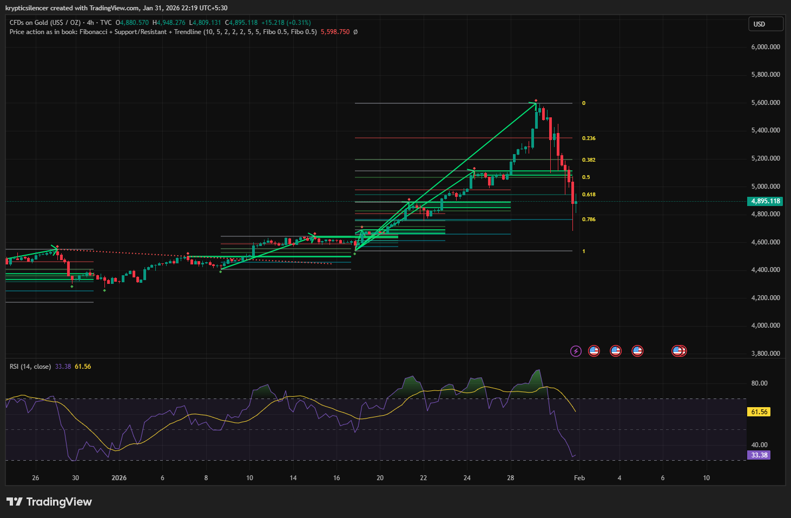

# Gold 4-Hour Overextension and Liquidation Pullback

**Date:** 2026-01-31  
**Time:** 22:19 IST  
**Instrument:** Gold (USD / oz)  
**Timeframe:** 4-hour  
**Venue:** TVC  
**Charting Platform:** TradingView  

---

## Context
Gold experienced a strong impulsive advance on the 4-hour timeframe,
characterized by steep trend acceleration and consecutive higher highs.
Price moved rapidly away from prior value, indicating overextension
from equilibrium.

## Technical Observation
The action peaked out at or just below the upper Fibonacci levels and then failed to stay above them, falling back sharply.

The correction passed through a number of Fibonacci levels, breaking the sharp trendline that defined the impulsive phase.
This kind of action is more indicative of momentum exhaustion than a smooth change in trend.
RSI turned sharply from strong levels and fell, indicating a rapid loss of bullish momentum.
The speed and extent of the action indicate liquidation pressure, likely working off long positions accumulated during the parabolic phase.

## Interpretation
The current decline appears to be a corrective liquidation following
overextension, rather than an immediate structural trend reversal.

Further downside or consolidation would be expected until price
re-establishes acceptance and momentum stabilizes.

## Notes
This entry documents an impulsive advance followed by a liquidation-style
pullback on the 4-hour timeframe.

Recorded for technical structure and momentum research only.
No trade recommendation or financial advice is expressed.
