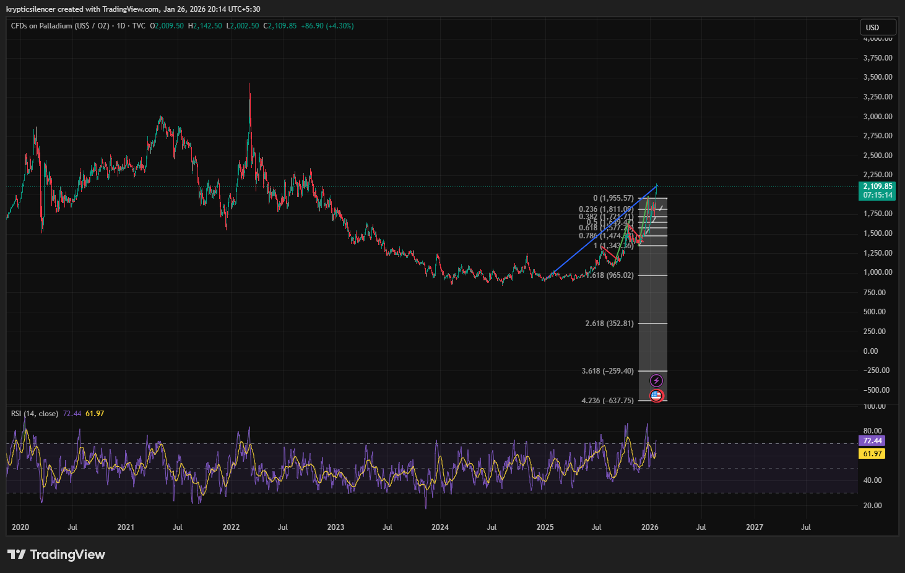

 # Palladium Daily Cup Structure and Impulsive Advance

**Date:** 2026-01-26  
**Time:** 20:14 IST  
**Instrument:** Palladium (USD / oz)  
**Timeframe:** Daily  
**Venue:** TVC  
**Charting Platform:** TradingView  

---

## Context
Palladium is currently in a strong bullish market trend on the daily chart, after a period of basing and 
structural recovery from previous lows.

The current price action suggests a growing bullish momentum with an expanding price range, which is a sign of a 
transition from an accumulation phase to an impulsive phase.

## Observation
Price has formed a rounded bottom base characteristic of a cup-and-handle recovery pattern, followed by a strong impulsive breakout to the upside.

The ongoing price move displays features of an early-stage impulsive wave, with a steep price trajectory and minimal overlap, typical of
a wave 1 type expansion phase of a larger-scale bullish pattern.

The Relative Strength Index (RSI) is strongly elevated, indicating a strong momentum phase but not yet in the momentum exhaustion phase.

## Hypothesis
If the impulsive move is complete and enters a corrective phase, a
consolidation or pullback may happen before potential trend
continuation on higher-degree impulsive patterns.

A move towards higher Fibonacci projection levels would be
dependent on the maintenance of higher lows and acceptance above
the breakout area.

## Notes
This entry documents a cup recovery structure and early impulsive phase
observed on the daily timeframe.

It is recorded solely for research and structural pattern-recognition
purposes. No trade recommendation, prediction, or financial advice is
inscribed.
