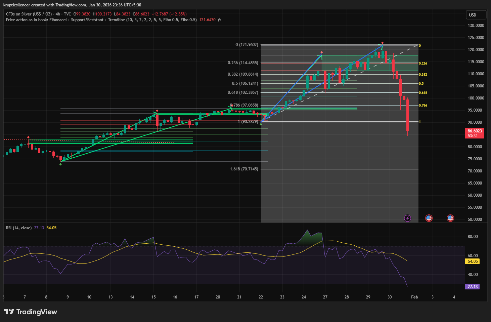

# Silver 4-Hour Breakdown Following Margin Hike and Momentum Shift

**Date:** 2026-01-30  
**Time:** 23:36 IST  
**Instrument:** Silver (USD / oz)  
**Timeframe:** 4-hour  
**Venue:** TVC  
**Charting Platform:** TradingView  

---

## Context
Silver was trading in a strong bullish structure, advancing through a
multi-week impulsive move supported by trendlines and Fibonacci
extensions. Price reached the upper portion of the projected range
before experiencing a sharp and accelerated selloff.

## Technical Observation
The decline came after a rejection close to the upper Fibonacci extension levels, as the price broke below the support of the rising trend and the important retracement levels. 
The momentum turned sour quickly, and the Relative Strength Index (RSI) turned from high levels to a strong decline, indicating a shift from trend-based action to liquidation-based action.

## Fundamental Factors
This sell-off occurred in tandem with a reported rise in margin requirements by the CME Group, which would have forced a reduction in positions and deleveraging among leveraged participants.
Furthermore, the U.S. Dollar Index (DXY) was seen at levels that were relatively low during the sell-off, indicating that the sell-off was not merely a result of a strong dollar.

## Interpretation
The speed and magnitude of the drop suggest forced liquidation rather
than a gradual trend reversal. Such moves often reflect structural
resetting following crowded positioning.

## Notes
This entry documents a technically and fundamentally aligned downside
event in silver.

Recorded for research and market-structure study only.
No trade recommendation or financial advice is expressed.
