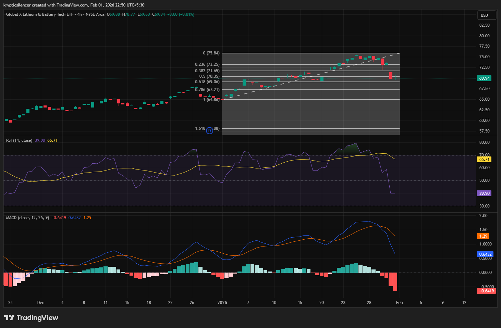

# Global X Lithium & Battery Tech ETF (LIT) 4-Hour Pullback After Uptrend

**Date:** 2026-02-01  
**Time:** 22:50 IST  
**Instrument:** Global X Lithium & Battery Tech ETF (LIT)  
**Timeframe:** 4-hour  
**Venue:** NYSE Arca  
**Charting Platform:** TradingView  

---

## Context
LIT has been showing an increasing trend on the 4-hour chart, forming a series of higher highs and higher lows, which was sustained by the rising trend line.
The price action has also moved into the upper part of the recent Fibonacci range, indicating a strong momentum phase.

## Observation
After testing the top of the range, price was unable to gain acceptance and has since pulled back towards the mid-range level of support.

The Relative Strength Index (RSI) has reversed from the high 60s and has fallen sharply, suggesting that the momentum has cooled off after a prolonged period of upside movement.

The Moving Average Convergence Divergence (MACD) oscillator has turned south with an increasingly negative histogram, which suggests that there has been a short-term change in momentum and a loss of upside momentum.

Despite the pullback, price is still above the lower Fibonacci retracement levels, which suggests that this is a correction within a range rather than a trend reversal at this point in time.

## Hypothesis
The current move may resolve as a corrective pullback within a broader
uptrend if price stabilizes near range support.
Failure to hold these levels would increase the probability of deeper
mean reversion.

## Notes
This entry documents a momentum pullback following an extended advance
on the 4-hour timeframe.

Recorded for research and market-structure analysis only.
No trade recommendation or financial advice is expressed.
