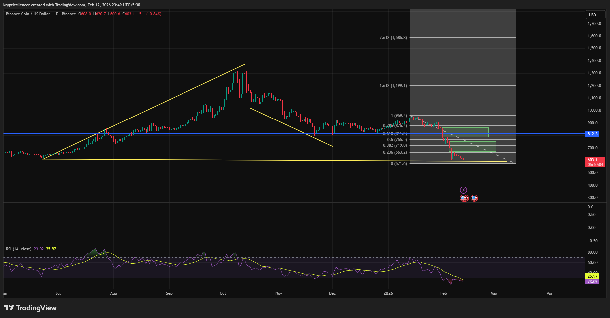

# BNB — 1D Distribution Breakdown & FVG Reaction Zones

**Date:** 2026-02-12  
**Time:** ~23:50 IST  
**Instrument:** BNBUSD  
**Timeframe:** 1D  
**Venue:** Binance  
**Charting Platform:** TradingView  

---

## Context

BNB previously formed a prolonged narrow consolidation range before initiating an impulsive upside expansion.  
Following the pump, price transitioned into a broader sideways distribution phase before resolving to the downside.

The current structure reflects confirmed bearish continuation after range breakdown.

---

## Observation

- **Accumulation → Expansion:**  
  A tight sideways range preceded the upside impulse, suggesting accumulation before expansion.

- **Distribution → Breakdown:**  
  A broader sideways structure formed near highs, ultimately resolving into a bearish head-and-shoulders pattern.  
  The breakdown below the neckline confirmed structural weakness.

- **Market Structure:**  
  Lower highs and lower lows now define the daily trend.

- **Fair Value Gaps (FVGs):**  
  The impulsive sell-off left visible inefficiencies (green rectangles) that may act as rebalancing targets if price attempts corrective rotation.

- **Key Levels:**  
  - **Yellow Line:** Long-term demand zone  
  - **Blue Line (0.618 Fibonacci):** Major retracement confluence level  
  These levels form a structural reaction area rather than a guaranteed reversal point.

- **Momentum (RSI):**  
  RSI is in lower territory, reflecting bearish momentum dominance.

---

## Hypothesis

The dominant structure remains **bearish** following confirmed distribution and breakdown.

Two conditional scenarios emerge:

### Scenario 1 — Corrective Rebalance
Price may rotate upward toward the FVG zones to rebalance inefficiencies before continuation.  
Acceptance above these zones would be required to shift bias.

### Scenario 2 — Demand Reaction
If price interacts with the long-term demand (yellow) and 0.618 Fibonacci confluence (blue), a reaction or corrective bounce is possible.  
Sustained reversal would require structural higher highs rather than temporary relief.

---

## Invalidation / Failure Mode

- Acceptance above FVG and prior lower high  
- Reclaim of key retracement levels with sustained momentum  
- Break of bearish structure on daily timeframe  

---

## Notes

This analysis documents a **distribution breakdown and potential rebalancing phase** within a broader bearish regime.

Text formatting and clarity were assisted by AI; the market analysis, structural interpretation, and scenario assessment are independently conducted by the author.  
This material is intended for educational and research documentation purposes only and does not constitute financial advice.
