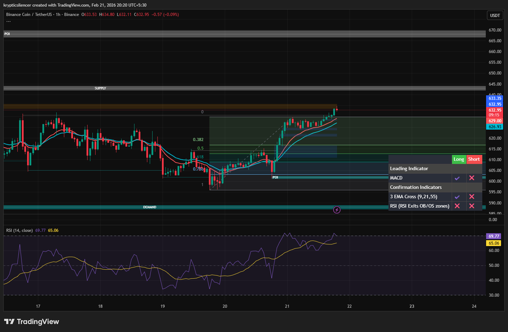

# BNB — 1H Bullish Expansion Into Imbalance (FVG Risk)

**Date:** 2026-02-21  
**Time:** ~20:20 IST  
**Instrument:** BNBUSDT  
**Timeframe:** 1H  
**Venue:** Binance  
**Charting Platform:** TradingView  

---

## Context

BNB has transitioned from corrective consolidation into strong bullish expansion on the 1H timeframe.  
Price reclaimed key Fibonacci retracement levels and is now approaching overhead supply.

However, the impulsive leg higher has created a significant Fair Value Gap (FVG), introducing rebalancing risk.

---

## Observation

### 1️⃣ Momentum Expansion
- Strong directional candles with minimal pullbacks.
- EMAs aligned upward.
- RSI elevated, reflecting bullish pressure.

### 2️⃣ Structure
- Higher lows established after demand reaction.
- Clear break of prior local resistance.

### 3️⃣ Imbalance (FVG)
- The impulsive rally left a large Fair Value Gap below price.
- Inefficiencies of this size often invite corrective retracements to rebalance order flow.

### 4️⃣ Overhead Supply
- Price approaching supply zone near local highs.
- Reaction probability increases at this confluence.

---

## Hypothesis

While short-term structure remains bullish, corrective rotation is probable due to imbalance below.

Two conditional paths:

### Scenario A — Shallow Pullback
Minor retracement into upper FVG before continuation toward supply.

### Scenario B — Deeper Rebalance
Price rotates deeper into the FVG region before resuming trend.

Momentum remains intact unless higher low structure is violated.

---

## Invalidation

- Breakdown below key higher low.
- Acceptance below reclaimed Fibonacci levels.

---

## Notes

This setup reflects bullish expansion with increased probability of short-term correction due to large imbalance.

Text formatting and clarity were assisted by AI; the market analysis and structural interpretation are independently conducted by the author.  
This material is intended for educational and research documentation purposes only and does not constitute financial advice.
