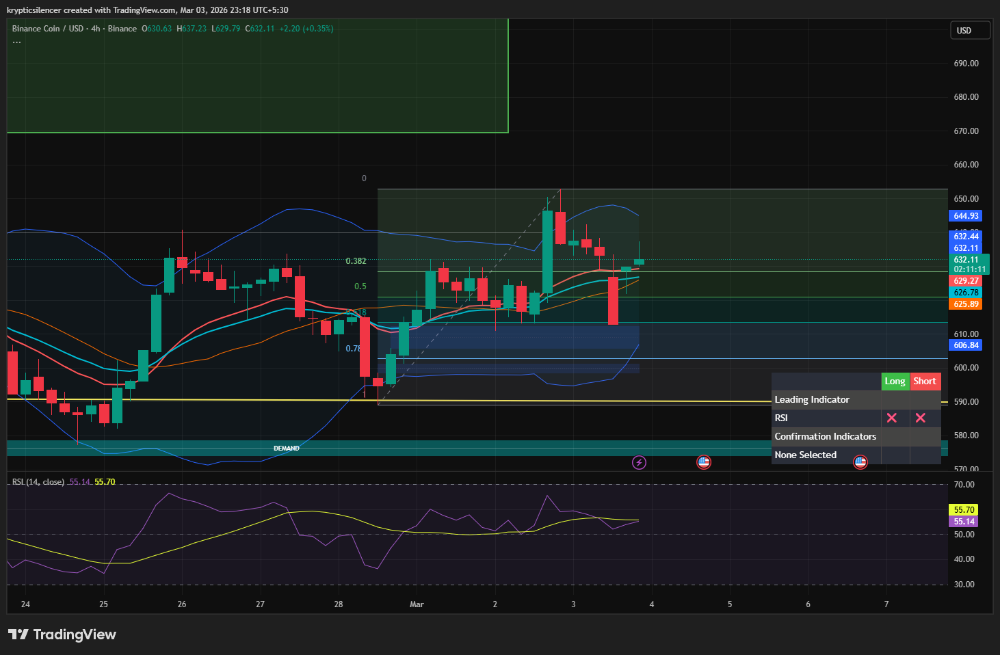

# BNB — 4H Recovery From Demand, Testing Mid-Range Supply

**Date:** 2026-03-03  
**Time:** ~23:15 IST  
**Instrument:** BNBUSD  
**Timeframe:** 4H  
**Venue:** Binance  
**Charting Platform:** TradingView  

---

## Context

BNB reacted strongly from higher timeframe demand after a corrective decline.  
The bounce created a short-term higher low and pushed price back into the mid-range of the broader structure.

Price is now approaching internal resistance within the range.

---

## Observation

### 1️⃣ Demand Reaction
- Clean impulse from marked demand zone (~580 region).
- Strong bullish displacement reclaimed prior structure.
- Higher low established following the reaction.

Demand remains respected on 4H.

### 2️⃣ Fibonacci Interaction
- Impulse retraced into the 0.5–0.618 region and held.
- Reaction formed above 0.786 support.
- Structure remains constructive while above discount.

### 3️⃣ Bollinger Band Expansion
- Bands expanded during impulse.
- Current candles rotating near upper-mid band.
- No extreme volatility extension yet.

### 4️⃣ Current Positioning
- Price testing mid-range supply (~640–650 region).
- RSI holding above midline, momentum stable.
- EMAs compressing beneath price, offering dynamic support.

---

## Hypothesis

Short-term bias remains constructive while price holds above recent higher low.

Two conditional paths:

### Scenario A — Continuation Toward Range High
Acceptance above internal supply could open expansion toward higher timeframe resistance (~670+).

### Scenario B — Mid-Range Rejection
Failure to break supply may result in rotation back toward equilibrium or deeper discount.

Until supply is decisively reclaimed, market remains rotational within range.

---

## Invalidation / Confirmation

- Strong 4H close above 650 region → continuation toward higher liquidity.
- Loss of recent higher low → deeper retracement likely.

---

## Notes

This setup documents a demand-driven recovery transitioning into mid-range supply interaction, where continuation or rejection will define the next directional move.

Text formatting and clarity were assisted by AI; the market analysis and structural interpretation are independently conducted by the author.  
This material is intended for educational and research documentation purposes only and does not constitute financial advice.
