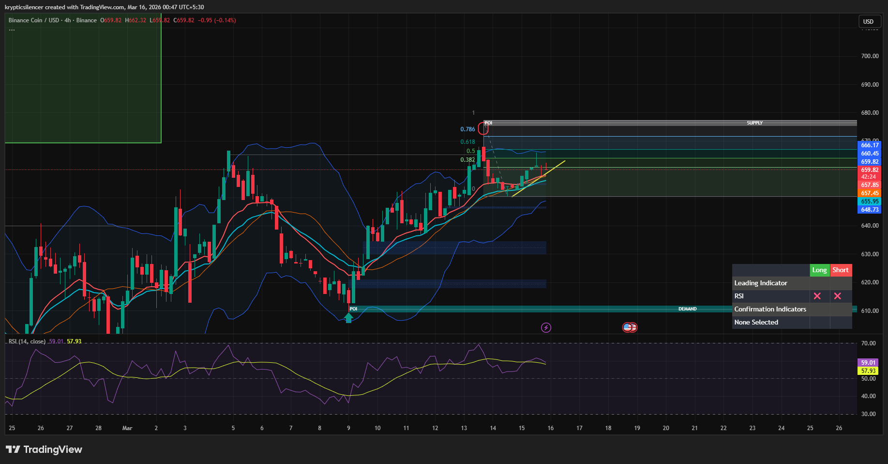

# BNB — 4H Cup Formation, Potential Bullish Continuation

**Date:** 2026-03-16  
**Time:** ~00:45 IST  
**Instrument:** BNBUSD  
**Timeframe:** 4H  
**Venue:** Binance  
**Charting Platform:** TradingView  

---

## Context

BNB has recovered steadily from a prior corrective decline and is now approaching a higher timeframe supply zone.  
During the recovery phase, price action has formed a **rounded base structure resembling a cup pattern**.

This formation often appears before bullish continuation when momentum rebuilds.

---

## Observation

### 1️⃣ Cup Formation
- Price formed a rounded bottom after the earlier decline.
- Gradual transition from lower lows to higher highs.
- Structure suggests accumulation rather than impulsive reversal.

### 2️⃣ Trend Recovery
- Higher highs and higher lows visible during the recovery.
- Price holding above key moving averages.
- Uptrend structure gradually strengthening.

### 3️⃣ Resistance Interaction
- Price approaching the **0.618–0.786 retracement region** and overhead supply.
- Temporary rejection visible near this zone.
- Resistance acting as short-term barrier.

### 4️⃣ Momentum Condition
- RSI near **58–59**, indicating bullish momentum without overbought conditions.
- Momentum stabilizing during consolidation.

---

## Hypothesis

The cup formation suggests bullish structure building before a potential continuation.

Two conditional paths:

### Scenario A — Bullish Continuation
If price consolidates above the current support area, momentum could push price toward higher supply levels.

### Scenario B — Short-Term Pullback
A brief pullback or retest may occur before continuation, allowing the structure to form a higher low.

As long as the recovery structure remains intact, the bullish bias persists.

---

## Invalidation / Confirmation

- Strong break above supply → bullish continuation confirmed.
- Loss of recent higher low → potential deeper retracement.

---

## Notes

This setup highlights a **cup-shaped recovery structure**, which often precedes continuation moves when momentum stabilizes beneath resistance.

Text formatting and clarity were assisted by AI; the market analysis and structural interpretation are independently conducted by the author.  
This material is intended for educational and research documentation purposes only and does not constitute financial advice.
