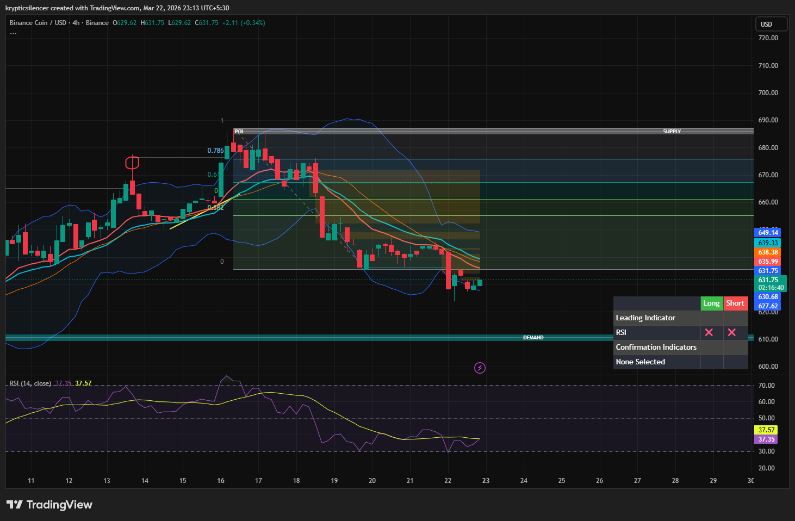

# BNB — 4H Bearish Continuation Within Range

**Date:** 2026-03-22  
**Time:** ~23:13 IST  
**Instrument:** BNBUSD  
**Timeframe:** 4H  
**Venue:** Binance  
**Charting Platform:** TradingView  

---

## Context

BNB previously moved into a premium supply region and faced rejection.  
Since then, price has been moving in a bearish corrective phase.

---

## Observation

### 1️⃣ Supply Rejection
- Price rejected from the upper supply zone.
- Lower highs forming after rejection.

### 2️⃣ Bearish Structure
- Clear downtrend on the 4H timeframe.
- Price trading below EMA cluster.

### 3️⃣ Fibonacci Range
- Price moving within the Fibonacci retracement range.
- Currently holding near the lower half of the range.

### 4️⃣ RSI Behavior
- RSI around ~37, indicating weak momentum and near oversold conditions.
- Potential for short-term relief bounce.

---

## Hypothesis

### Scenario A — Bearish Continuation
Price may continue downward toward the demand zone.

### Scenario B — Short-Term Relief Bounce
Due to near-oversold RSI, price may bounce toward mid-range before continuation down.

---

## Invalidation / Confirmation

- Break below demand → continuation downward.
- Reclaim above 0.5 Fib → structure shift.

---

## Notes

This setup reflects a typical correction after supply rejection, with price potentially moving from supply toward demand in a range-based environment.

Text formatting and clarity were assisted by AI; the market analysis and structural interpretation are independently conducted by the author.  
This material is intended for educational and research documentation purposes only and does not constitute financial advice.
