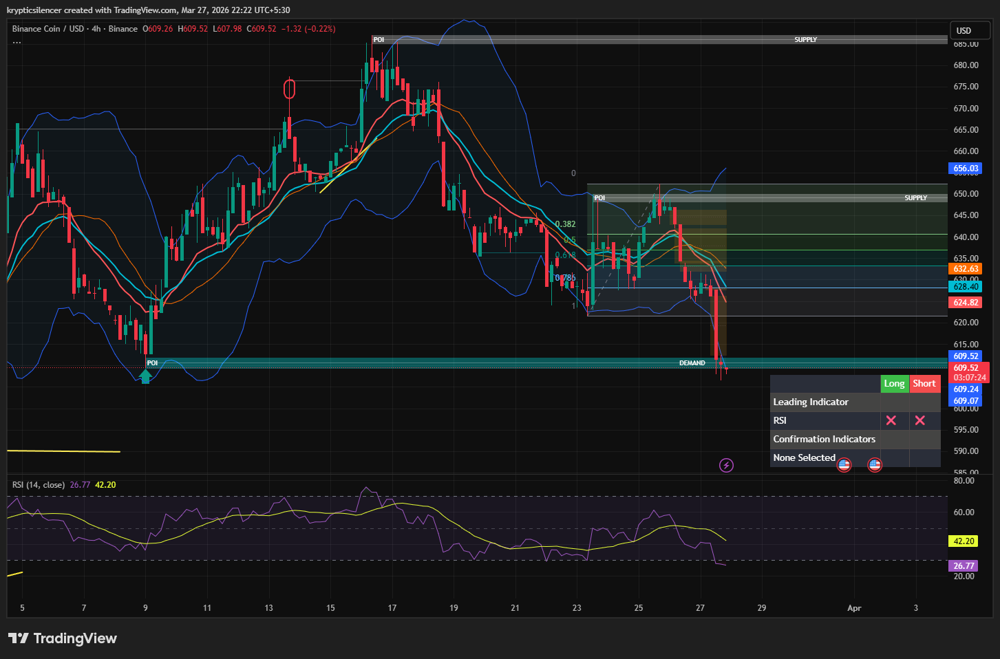

# BNB — Rejection From Supply → Move Into Demand

**Date:** 2026-03-27  
**Timeframe:** 4H  
**Instrument:** BNBUSD  

---

## Context

BNB rejected from the supply zone and has been in a bearish move since then. Price has now moved down into a key demand zone where a reaction may occur.

---

## Observation

### 1️⃣ Supply Rejection
- Price previously moved into a supply zone and faced strong rejection.
- This led to a bearish move with lower highs and lower lows.

### 2️⃣ Fibonacci Structure
- Price retraced and respected Fibonacci levels during the move.
- Bearish continuation followed after failing to hold higher fib levels.

### 3️⃣ Demand Zone
- Price has now reached a marked demand zone.
- This is a key reaction area where buyers may step in.

### 4️⃣ RSI
- RSI is in the lower range (~26–42), indicating weak momentum and approaching oversold conditions.

---

## Hypothesis

### Scenario A — Bounce From Demand
If demand holds, BNB may see a short-term bullish retracement toward mid-range or EMA levels.

### Scenario B — Demand Break
If price breaks below demand, the bearish move may continue toward the next lower demand zone.

---

## Invalidation / Confirmation

- Strong bullish reaction → confirms bounce.
- Clean break below demand → confirms continuation downward.

---

## Notes

This is a classic supply-to-demand move. The reaction at demand will determine whether this becomes a retracement or a continuation.

This material is for educational and research documentation purposes only and does not constitute financial advice.
