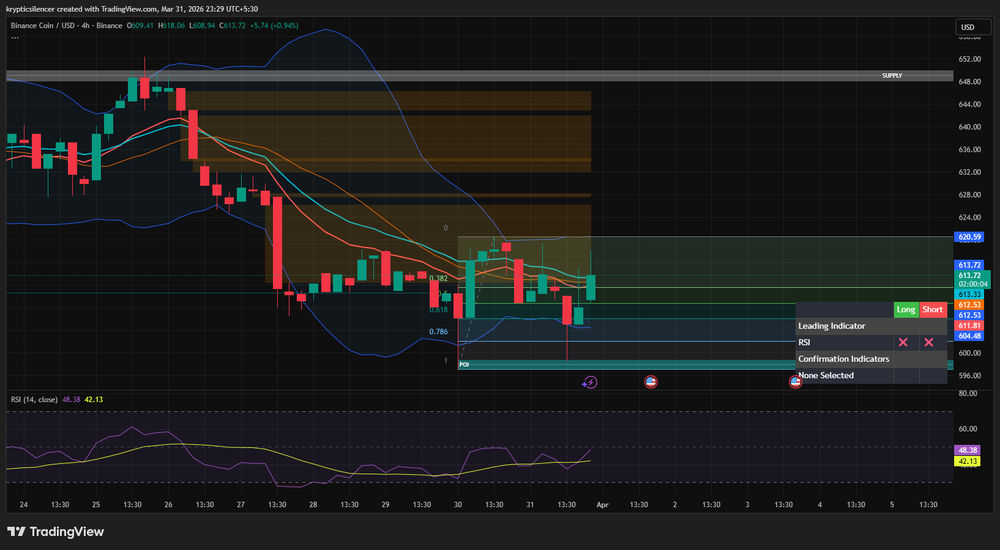

# BNB — Retracement Into Fibonacci Zone After Demand Reaction

**Date:** 2026-03-31  
**Timeframe:** 4H  
**Instrument:** BNBUSD  

---

## Context

BNB previously moved down into a demand zone and reacted upward. Price is now retracing into the Fibonacci retracement zone and moving inside a range, indicating a decision area.

---

## Observation

### 1️⃣ Demand Reaction
- Price touched demand and moved upward.
- This created a short-term bullish retracement.

### 2️⃣ Fibonacci Zone
- Price currently between 0.382 and 0.5 Fibonacci levels.
- This zone often acts as a decision/resistance area in a bearish structure.

### 3️⃣ Bollinger Bands
- Price moving near the middle Bollinger Band.
- Indicates range behavior rather than strong trend.

### 4️⃣ RSI
- RSI around mid-range (~42–48).
- No strong momentum in either direction.

### 5️⃣ Structure
- Overall structure still slightly bearish.
- Current move appears to be a retracement, not a full reversal.

---

## Hypothesis

### Scenario A — Bearish Continuation
If price gets rejected from the Fibonacci zone, BNB may move back toward demand.

### Scenario B — Bullish Break
If price breaks and holds above the 0.5 Fibonacci level, BNB may move toward the supply zone.

---

## Invalidation / Confirmation

- Rejection from 0.5 Fib → bearish continuation.
- Break above 0.5 Fib → bullish continuation.

---

## Notes

This is a retracement into a Fibonacci decision zone. The reaction here will determine whether price continues bearish or transitions into a bullish move.

This material is for educational and research documentation purposes only and does not constitute financial advice.
