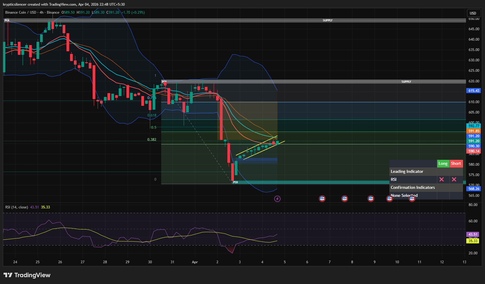

# Binance Coin — 4H Bullish Rebound Into Imbalance

**Date:** 2026-04-04  
**Time:** ~22:48 IST  
**Instrument:** BNBUSD  
**Timeframe:** 4H  
**Venue:** Binance  
**Charting Platform:** TradingView  

---

## Context

Binance Coin experienced a strong impulsive move downward followed by a sharp bullish reaction from a demand/POI zone. The current price action shows a recovery phase after the sell-side imbalance, with price attempting to rebalance the inefficiency created during the impulsive drop.

---

## Observation

- **Market Structure:**  
  The broader structure remains bearish, but the current short-term structure shows a strong bullish reaction from the recent low, forming higher lows on the lower timeframe.

- **Impulsive Reversal:**  
  A strong bullish move originated from the demand/POI zone, indicating aggressive buying interest at lower levels.

- **Fair Value Gap (FVG):**  
  Price is currently moving upward toward a visible FVG/supply zone above, suggesting a rebalancing move rather than immediate continuation down.

- **Momentum (RSI):**  
  RSI is rebounding from lower levels and rising steadily without showing immediate bearish divergence, supporting short-term bullish momentum.

- **Trendline Structure:**  
  Price is respecting a short-term ascending trendline, indicating controlled bullish continuation toward the imbalance zone.

---

## Hypothesis

The current move appears to be a **short-term bullish rebalancing phase** toward the FVG zone.

Two conditional paths:

### Scenario 1 — FVG Tap and Rejection
If price reaches the FVG/supply zone and shows rejection, the broader bearish trend may resume, leading to continuation to the downside.

### Scenario 2 — Break and Structure Shift
If price breaks and holds above the FVG/supply zone, then a short-term market structure shift may occur, potentially leading to a deeper retracement upward.

---

## Invalidation / Failure Mode

- Breakdown below the recent higher low  
- Loss of ascending trendline support  
- RSI showing bearish divergence with price near resistance  

---

## Notes

This analysis documents a **short-term bullish momentum move into a higher timeframe imbalance**, not a confirmed full trend reversal.

Text formatting and clarity were assisted by AI; the market analysis, chart interpretation, and structural assessment are independently conducted by the author.  
This material is intended for educational and research documentation purposes only and does not constitute financial advice.
