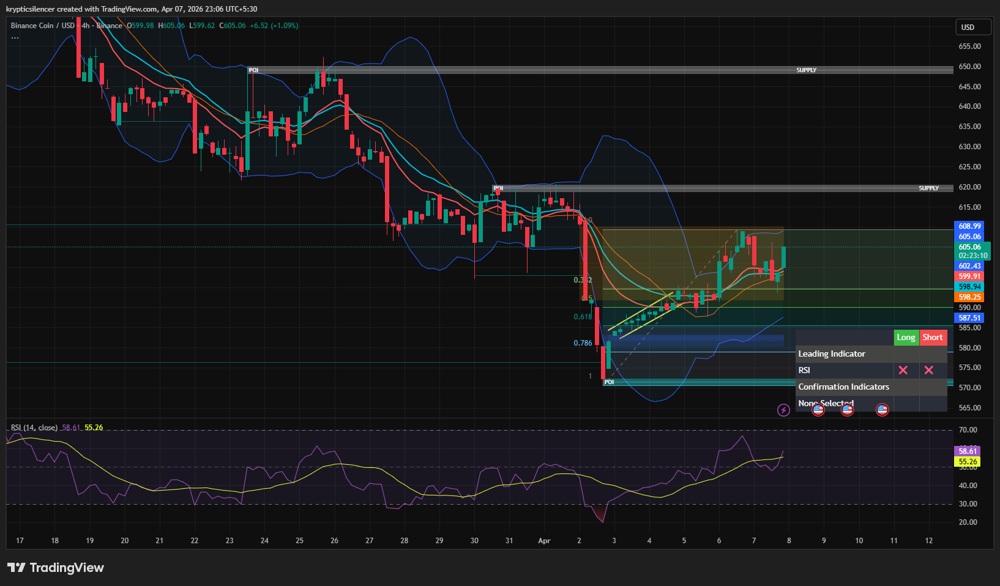

# Binance Coin — 4H Bullish Rebalancing Into Supply

**Date:** 2026-04-07  
**Time:** ~23:06 IST  
**Instrument:** BNBUSD  
**Timeframe:** 4H  
**Venue:** Binance  
**Charting Platform:** TradingView  

---

## Context

Binance Coin previously experienced a strong impulsive sell-off into a demand/POI zone, followed by a steady recovery. Price is currently in a rebalancing phase, moving upward after the sharp decline, attempting to fill inefficiencies left by the bearish impulse.

---

## Observation

- **Market Structure:**  
  Short-term structure has shifted bullish with formation of higher lows and gradual upward movement, while the broader trend remains bearish.

- **Impulsive Reaction:**  
  Strong bullish reaction from the demand/POI zone (~570–580), indicating significant buying interest.

- **Fibonacci Retracement:**  
  Price has reclaimed the 0.5–0.618 retracement region and is now approaching the upper retracement/supply area.

- **Supply Zone:**  
  Overhead supply near ~610 acts as a key resistance zone where price is currently reacting.

- **Momentum (RSI):**  
  RSI is trending upward and holding above midline, indicating strengthening bullish momentum.

- **Trendline Support:**  
  Price respects a short-term ascending trendline, supporting continued upward movement.

---

## Hypothesis

The market is currently in a **bullish rebalancing phase into supply** following the prior sell-off.

Two conditional paths:

### Scenario 1 — Supply Rejection
If price rejects from the supply zone (~610), the broader bearish trend may resume, leading to downside continuation.

### Scenario 2 — Break and Continuation
If price breaks and holds above the supply zone, a short-term structure shift may occur, leading to further upside continuation.

---

## Invalidation / Failure Mode

- Breakdown below recent higher low  
- Loss of ascending trendline support  
- RSI losing midline support and turning bearish  

---

## Notes

This analysis documents a **short-term bullish rebalancing move into supply**, not a confirmed full trend reversal.

Text formatting and clarity were assisted by AI; the market analysis, chart interpretation, and structural assessment are independently conducted by the author.  
This material is intended for educational and research documentation purposes only and does not constitute financial advice.
