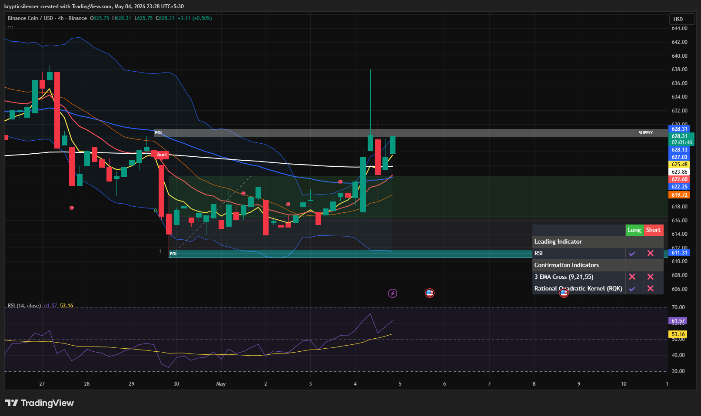

# Binance Coin — 4H Supply Tap & Short-Term Exhaustion

**Date:** 2026-05-04  
**Time:** ~23:25 IST  
**Instrument:** BNBUSD  
**Timeframe:** 4H  
**Venue:** Binance  
**Charting Platform:** TradingView  

---

## Context

Binance Coin has printed a strong bullish recovery from local demand and is now trading directly into overhead supply on the 4H timeframe.

Price has reached the upper Bollinger Band while testing resistance, increasing the probability of short-term exhaustion.

---

## Observation

- **Market Structure:**  
  BNB has recovered cleanly from local lows and reclaimed short-term bullish structure.

- **Supply Test:**  
  Price is now trading directly into the marked supply zone, where prior seller activity was concentrated.

- **Upper Bollinger Band:**  
  BNB has tapped the upper Bollinger Band while testing resistance, signaling short-term extension.

- **Momentum (RSI):**  
  RSI is rising with bullish momentum, but elevated positioning suggests reduced upside efficiency in the immediate term.

---

## Hypothesis

BNB remains bullish in structure, but short-term price is likely extended into resistance.

### Scenario 1 — Short-Term Pullback
A local pullback or consolidation is likely after the upper Bollinger Band tap before further continuation.

### Scenario 2 — Bullish Continuation
If BNB absorbs supply and holds above resistance, continuation toward higher levels remains possible.

---

## Invalidation / Failure Mode

- Immediate breakout with strong follow-through  
- No reaction from supply despite upper band extension  
- Sharp breakdown below reclaimed local support  

---

## Notes

This setup reflects **short-term exhaustion into supply**, with a local pullback likely before the next directional move.

Text formatting and clarity were assisted by AI; the market analysis, chart interpretation, and structural assessment are independently conducted by the author.  
This material is intended for educational and research documentation purposes only and does not constitute financial advice.
