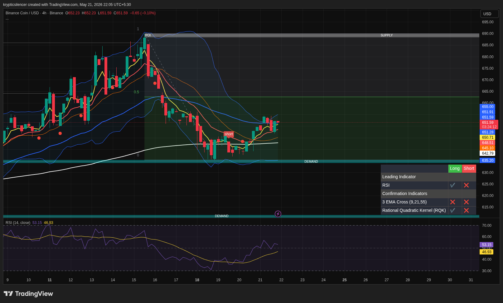

# BNB — 4H Recovery From Demand

**Date:** 2026-05-21  
**Time:** 22:05 IST  
**Instrument:** BNBUSD  
**Timeframe:** 4H  
**Venue:** Binance  
**Charting Platform:** TradingView  

---

## Context

BNB is attempting a bullish recovery after reacting strongly from higher timeframe demand. Price has reclaimed short-term moving averages and is now stabilizing above local support.

---

## Observation

- **Market Structure:**  
Short-term structure has shifted bullish with higher lows forming after the recent sweep into demand.

- **Demand Zone:**  
Buyers defended the demand region aggressively, leading to a strong rebound from local lows.

- **Momentum:**  
RSI is recovering steadily from oversold conditions, indicating improving bullish momentum.

- **EMA Structure:**  
Price reclaimed the short-term EMA cluster, suggesting strengthening short-term trend continuation.

- **Resistance Region:**  
BNB still trades below a major higher timeframe supply zone where sellers may become active again.

---

## Hypothesis

BNB is currently in a recovery phase with bullish momentum gradually building.

### Scenario 1 — Continuation
If price sustains above current support and reclaims local resistance, continuation toward supply becomes likely.

### Scenario 2 — Rejection
Failure to maintain higher lows may lead to another retest of the demand region.

---

## Invalidation / Failure Mode

- Breakdown below local demand support  
- Loss of bullish EMA alignment  
- RSI weakening sharply below midline  

---

## Notes

Momentum currently favors buyers after the strong reaction from demand, though higher timeframe resistance still remains overhead.

This analysis is for educational and observational purposes only and does not constitute financial advice.
