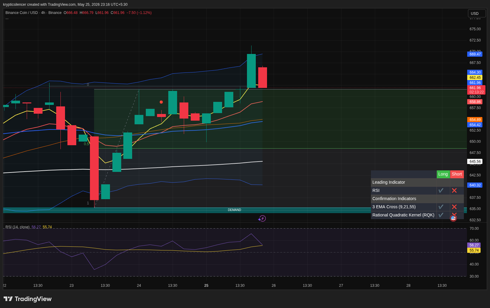

# BNB — 4H Bullish Continuation Above EMA Structure

**Date:** 2026-05-25  
**Time:** 23:16 IST  
**Instrument:** BNBUSD  
**Timeframe:** 4H  
**Venue:** Binance  
**Charting Platform:** TradingView  

---

## Context

BNB continues showing bullish recovery momentum after reclaiming short-term structure from the recent demand reaction. Price remains supported above key moving averages despite minor pullback candles.

---

## Observation

- **Market Structure:**  
Higher lows continue forming with bullish continuation structure still intact.

- **Momentum:**  
RSI remains above midline levels, indicating sustained bullish momentum despite recent slowing.

- **EMA Structure:**  
Price continues trading above major short-term EMAs, supporting trend continuation.

- **Demand Reaction:**  
The earlier reaction from higher timeframe demand created a strong impulsive recovery leg.

- **Resistance Region:**  
Price is approaching a local resistance zone where short-term rejection pressure may appear.

---

## Hypothesis

BNB remains in a bullish continuation phase while structure stays above key support.

### Scenario 1 — Continuation
If buyers maintain current support levels, price may continue expanding toward higher resistance zones.

### Scenario 2 — Pullback
Failure to sustain momentum may trigger a short-term retracement into EMA support before continuation.

---

## Invalidation / Failure Mode

- Breakdown below EMA support cluster  
- Loss of higher low structure  
- RSI weakening sharply below midline  

---

## Notes

Current momentum still favors buyers while BNB holds above reclaimed structure. Minor pullbacks remain possible near resistance, though trend conditions remain constructive overall.

This analysis is for educational and observational purposes only and does not constitute financial advice.
