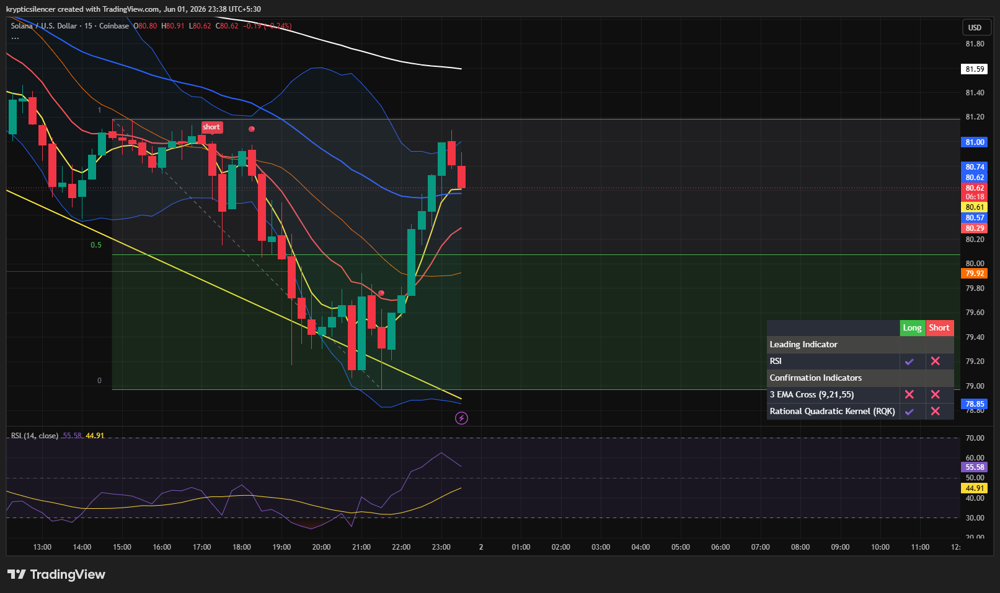

# Solana — 15M Recovery Rally Into Local Resistance

**Date:** 2026-06-01
**Time:** ~23:38 IST
**Instrument:** SOLUSD
**Timeframe:** 15M
**Venue:** Coinbase
**Charting Platform:** TradingView

---

## Context

Solana experienced a sharp selloff from local highs before finding support near the lower boundary of the active range.

Following the decline, buyers stepped in aggressively, producing a strong recovery rally that reclaimed multiple short-term moving averages and pushed price back toward overhead resistance.

---

## Observation

### 1️⃣ Strong Recovery From Local Lows

* Price reacted strongly from the lower range boundary.
* Multiple bullish candles created a sharp V-shaped recovery.
* The previous bearish impulse has been partially retraced.

This indicates buyers successfully defended local support.

### 2️⃣ Resistance Test

* Price rallied directly into the 80.6–81.0 resistance region.
* The latest candle shows rejection after touching the upper zone.
* Supply remains active despite the recovery.

The market is now testing whether buyers have enough strength for continuation.

### 3️⃣ EMA Reclaim

* Price reclaimed the short-term EMA cluster during the rally.
* Fast EMAs have begun turning upward.
* Momentum has shifted positively compared to earlier sessions.

This is the first sign of improving short-term structure.

### 4️⃣ RSI Momentum

* RSI surged from oversold territory into the mid-50 region.
* Momentum expansion accompanied the recovery move.
* However, RSI remains below extreme bullish conditions.

Momentum currently favors buyers but has not reached exhaustion levels.

---

## Hypothesis

Solana is attempting a short-term bullish reversal after successfully defending support.

Two conditional paths remain active:

### Scenario A — Bullish Continuation

Acceptance above the 80.6–81.0 resistance region would confirm buyer strength and could trigger continuation toward higher liquidity and resistance overhead.

### Scenario B — Resistance Rejection

Failure to break resistance may result in a pullback toward the reclaimed EMA cluster and recent support zone before another directional attempt.

For now, momentum favors buyers while price remains above the recent recovery base.

---

## Invalidation / Confirmation

* Break and acceptance above local resistance → bullish continuation confirmed.
* Rejection followed by loss of EMA support → recovery thesis weakens.
* Higher low formation above support → bullish structure maintained.

---

## Notes

This setup highlights a strong recovery from local support following a sharp intraday decline. The key question is whether buyers can convert the current resistance test into acceptance, or if the rally will remain a corrective bounce within a broader consolidation structure.

Text formatting and clarity were assisted by AI; the market analysis and structural interpretation are independently conducted by the author.
This material is intended for educational and research documentation purposes only and does not constitute financial advice.
