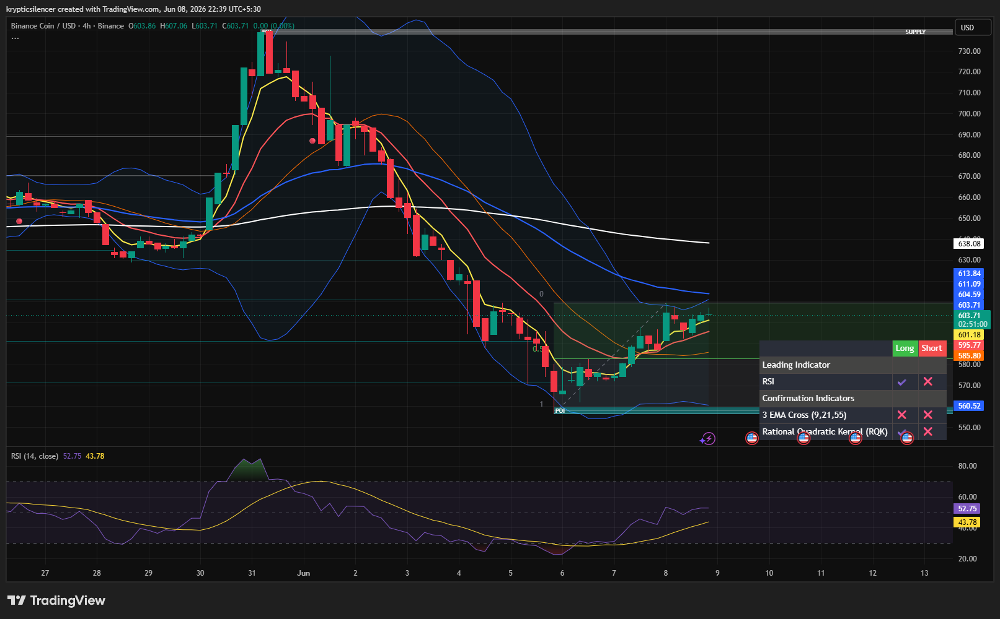

# BNB — 4H Recovery Rally From Demand Zone

**Date:** 2026-06-08
**Time:** ~22:39 IST
**Instrument:** BNBUSD
**Timeframe:** 4H
**Venue:** Binance
**Charting Platform:** TradingView

---

## Context

BNB experienced a prolonged bearish decline following rejection from higher-timeframe highs, creating a series of lower highs and lower lows throughout the previous week.

After reaching a major demand zone near the recent swing low, selling pressure began to fade and buyers stepped in aggressively, initiating a recovery rally from oversold conditions.

---

## Observation

### 1️⃣ Strong Demand Zone Reaction

* Price formed a clear bottom inside the marked demand region.
* Multiple bullish candles emerged immediately after the liquidity sweep.
* Buyers successfully defended support and prevented further downside continuation.

The demand zone remains respected by the market.

### 2️⃣ Recovery Structure

* BNB has established a sequence of higher lows since the bottom formed.
* Price recovered a significant portion of the previous decline.
* Recent candles show sustained buying pressure rather than a single relief spike.

This suggests improving short-term market structure.

### 3️⃣ EMA Reclamation

* Price has reclaimed the fast EMA cluster.
* Short-term moving averages are beginning to turn upward.
* The 21 EMA has crossed above the fastest moving average support region.

Momentum has shifted positively compared to the capitulation phase.

### 4️⃣ RSI Recovery

* RSI recovered from oversold territory and moved back above the 50 level.
* Momentum is improving alongside price action.
* No signs of momentum exhaustion are currently visible.

This supports continued recovery potential.

### 5️⃣ Approaching Resistance

* Price is now approaching the 0.5 retracement region of the recent bearish leg.
* Higher-timeframe EMAs remain overhead.
* Nearby resistance zones may attract profit-taking activity.

The next reaction around resistance will provide important information regarding trend strength.

---

## Hypothesis

BNB is attempting to transition from a capitulation recovery into a broader corrective rally.

Two conditional paths remain active:

### Scenario A — Bullish Continuation

Acceptance above the current retracement zone and continuation of higher lows could extend the rally toward higher liquidity and overhead resistance levels.

### Scenario B — Corrective Rejection

Failure to break resistance may produce a pullback toward reclaimed EMA support and the midpoint of the recovery range before another directional attempt.

For now, short-term momentum favors buyers while price remains above recent swing lows.

---

## Invalidation / Confirmation

* Break above retracement resistance and continuation of higher highs → bullish continuation confirmed.
* Loss of reclaimed EMA support → recovery thesis weakens.
* Higher low formation above demand → bullish structure remains intact.

---

## Notes

This setup reflects a classic demand-zone reversal following an extended bearish decline. The recovery is supported by improving RSI conditions, reclaimed EMA structure, and the development of higher lows. While higher-timeframe resistance remains overhead, buyers currently maintain short-term control of momentum.

Text formatting and clarity were assisted by AI; the market analysis and structural interpretation are independently conducted by the author.
This material is intended for educational and research documentation purposes only and does not constitute financial advice.
