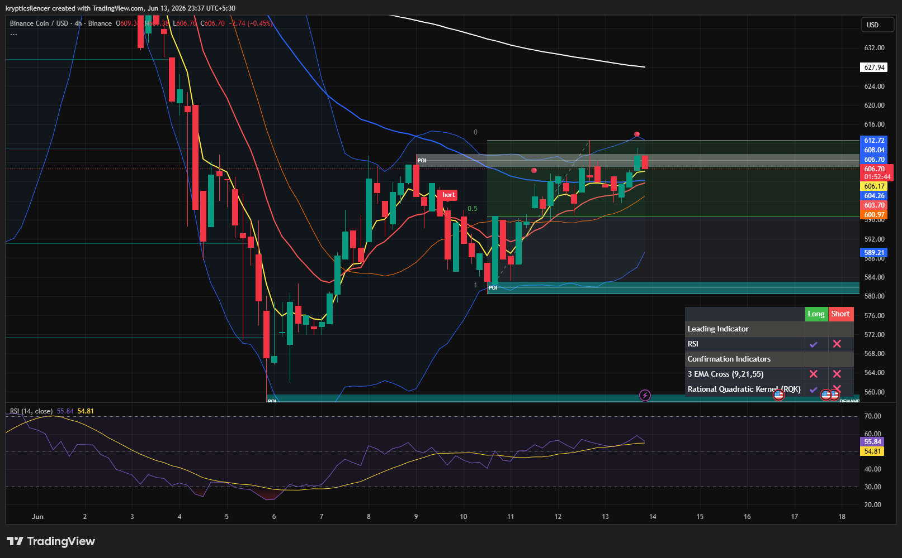

# BNB — 4H Recovery Tests Major Resistance Zone

**Date:** 2026-06-13
**Time:** ~23:37 IST
**Instrument:** BNBUSD
**Timeframe:** 4H
**Venue:** Binance
**Charting Platform:** TradingView

---

## Context

BNB has continued its recovery from the major demand zone established after the sharp selloff earlier in the month. Buyers successfully defended support and gradually reclaimed short-term market structure through a sequence of higher lows and higher highs.

The recovery has now carried price directly into a significant resistance and supply region, creating an important decision point for the market.

---

## Observation

### 1️⃣ Sustained Recovery Structure

* Price has maintained a sequence of higher lows since the capitulation bottom.
* Buyers have consistently defended pullbacks throughout the recovery.
* The overall structure remains constructive while above recent swing lows.

This confirms continued short-term bullish control.

### 2️⃣ Supply Zone Test

* Price is currently testing a major supply region near recent highs.
* Multiple candles have reached resistance but have struggled to establish acceptance above it.
* Sellers remain active within the overhead supply area.

This zone represents the primary obstacle for further upside expansion.

### 3️⃣ EMA Alignment

* Price remains above the short-term EMA cluster.
* Fast EMAs are sloping upward and acting as dynamic support.
* Recent pullbacks have respected the EMA structure.

Momentum remains favorable for buyers while EMA support holds.

### 4️⃣ RSI Strength

* RSI continues to hold above the midline and remains near the upper half of its range.
* Momentum has improved significantly compared to conditions at the demand zone low.
* No major bearish divergence is currently visible.

Momentum supports the ongoing recovery.

### 5️⃣ Compression Beneath Resistance

* Recent candles show increasing overlap beneath supply.
* Volatility has contracted as price approaches resistance.
* The market appears to be building liquidity near a key breakout level.

This often precedes a significant directional move.

---

## Hypothesis

BNB is consolidating beneath a major resistance zone while maintaining a constructive recovery structure.

Two conditional paths remain active:

### Scenario A — Bullish Breakout

Acceptance above supply and continuation of higher highs would confirm buyer strength and open the path toward higher liquidity and resistance overhead.

### Scenario B — Supply Rejection

Failure to overcome resistance could trigger a corrective pullback toward EMA support and the midpoint of the recovery range before another attempt higher.

As long as higher lows remain intact, buyers maintain the structural advantage.

---

## Invalidation / Confirmation

* Break and acceptance above supply → bullish continuation confirmed.
* Loss of EMA support and recent higher lows → recovery thesis weakens.
* Continued consolidation beneath resistance → breakout pressure continues building.

---

## Notes

This setup reflects a strong recovery trend transitioning into a resistance test. BNB has shown consistent buyer participation since the demand-zone reversal, but the current supply region remains the key battleground. The outcome of this consolidation will likely determine whether the recovery evolves into a larger bullish continuation or pauses for a corrective retracement.

Text formatting and clarity were assisted by AI; the market analysis and structural interpretation are independently conducted by the author.
This material is intended for educational and research documentation purposes only and does not constitute financial advice.
