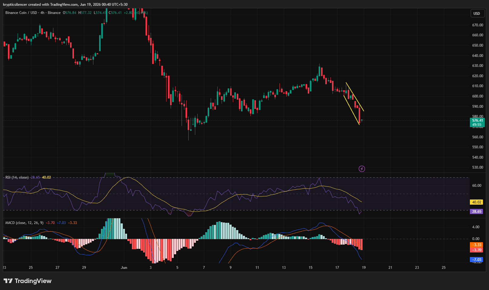

# BNB — 4H Bearish Acceleration Into Oversold Conditions

**Date:** 2026-06-19
**Time:** ~00:40 IST
**Instrument:** BNBUSD
**Timeframe:** 4H
**Venue:** Binance
**Charting Platform:** TradingView

---

## Context

BNB remains under sustained bearish pressure following a failed recovery attempt earlier in the month. After peaking near the 630 region, sellers regained control and pushed price into a fresh impulsive decline.

Recent candles show increasing downside momentum as price approaches a previously defended support area.

---

## Observation

### 1️⃣ Bearish Impulse Structure

* Price continues to form lower highs and lower lows.
* Recent candles display strong bearish displacement with limited bullish response.
* Market structure remains firmly bearish on the 4H timeframe.

Sellers maintain clear short-term control.

### 2️⃣ Descending Channel Breakdown

* Recent price action developed inside a short-term descending channel.
* The latest selloff accelerated toward the lower boundary of the move.
* No meaningful bullish reversal structure has formed yet.

Current movement favors continuation rather than reversal.

### 3️⃣ RSI Oversold Conditions

* RSI has fallen below the 30 level.
* Momentum is approaching oversold territory.
* Historically, such readings often lead to temporary relief rallies.

Oversold does not imply trend reversal, but it increases the probability of a short-term bounce.

### 4️⃣ MACD Bearish Expansion

* MACD remains below the signal line.
* Histogram bars continue expanding negatively.
* Momentum confirms the ongoing downside pressure.

Bearish momentum remains dominant across trend indicators.

### 5️⃣ Support Zone Reaction

* Price is approaching an important reaction area near recent lows.
* This zone previously attracted buying interest.
* Market participants will watch for signs of absorption or further liquidation.

The next reaction at support may determine short-term direction.

---

## Hypothesis

BNB remains in a bearish trend but is approaching conditions where a temporary relief rally becomes increasingly likely.

Two conditional paths remain active:

### Scenario A — Relief Bounce

A successful defense of current support combined with improving momentum could trigger a short-term recovery toward nearby resistance levels.

### Scenario B — Continued Breakdown

Failure to attract buyers at support would confirm continued bearish control and open the path toward deeper liquidity below recent lows.

At present, trend structure remains bearish despite oversold readings.

---

## Invalidation / Confirmation

* Bullish reaction and higher low formation → relief bounce confirmed.
* Reclaim of recent breakdown levels → bearish momentum weakens.
* Breakdown below current support → continuation confirmed.

---

## Notes

This setup highlights a strong bearish continuation phase with momentum indicators confirming downside pressure. While RSI is entering oversold territory and may support a short-term bounce, the broader market structure remains bearish until meaningful resistance levels are reclaimed.

Text formatting and clarity were assisted by AI; the market analysis and structural interpretation are independently conducted by the author.
This material is intended for educational and research documentation purposes only and does not constitute financial advice.
