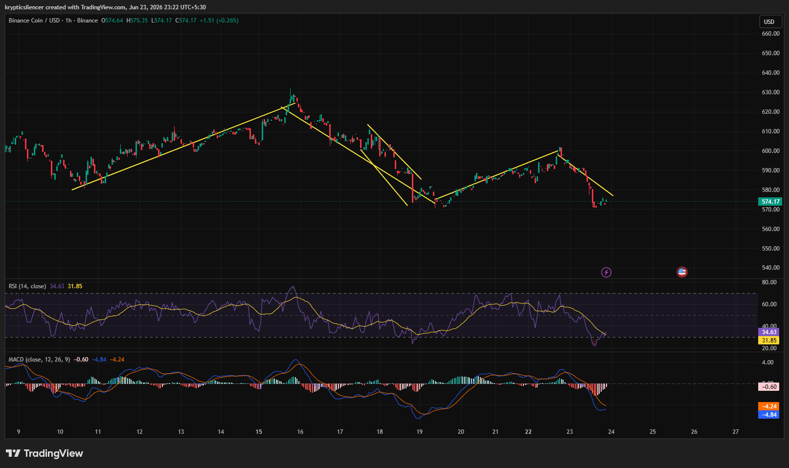

# BNB — 1H Repeated Trendline Failures Signal Persistent Bearish Pressure

**Date:** 2026-06-23
**Time:** ~23:23 IST
**Instrument:** BNBUSD
**Timeframe:** 1H
**Venue:** Binance
**Charting Platform:** TradingView

---

## Context

BNB has spent the past two weeks rotating through a sequence of rallies and corrections without establishing a sustained bullish trend. Recent price action shows repeated attempts to recover, but each rally has ultimately been rejected, producing a series of lower highs.

The market is currently testing support again after another failed recovery leg.

---

## Observation

### 1️⃣ Repeated Trendline Rejections

* Multiple ascending recovery structures have formed during the period.
* Each bullish advance eventually lost momentum and broke below trend support.
* Successive breakdowns have resulted in progressively weaker market structure.

The inability to sustain rallies highlights persistent selling pressure.

### 2️⃣ Lower High Formation

* Recent recovery topped near the 600 region before reversing.
* Price failed to reclaim previous swing highs.
* The latest decline continues the sequence of lower highs.

This behavior favors bearish continuation over trend reversal.

### 3️⃣ RSI Near Oversold Territory

* RSI has fallen back toward the low-30 region.
* Momentum remains weak despite a small bounce from recent lows.
* Buyers have not yet generated a meaningful momentum shift.

The market is approaching oversold conditions but lacks strong reversal signals.

### 4️⃣ MACD Remains Bearish

* MACD remains below the signal line.
* Histogram readings continue to print negative values.
* Downside momentum has eased slightly but remains dominant.

Momentum indicators continue to favor sellers.

### 5️⃣ Support Zone Test

* Price has returned to an area that previously generated buying interest.
* Recent candles show stabilization near support.
* A decisive reaction is still pending.

The current zone may determine whether BNB consolidates or extends lower.

---

## Hypothesis

BNB remains structurally weak after multiple failed recovery attempts and repeated trendline breakdowns.

Two conditional paths remain active:

### Scenario A — Relief Bounce

A successful defense of current support combined with improving momentum could generate a short-term recovery toward recent resistance levels.

### Scenario B — Bearish Continuation

Failure to hold support would confirm the broader pattern of lower highs and open the path toward deeper downside targets.

Current structure favors caution until buyers demonstrate sustained strength.

---

## Invalidation / Confirmation

* Break above recent lower high → bearish structure weakens.
* RSI recovery with bullish momentum expansion → relief rally gains credibility.
* Breakdown below current support → bearish continuation confirmed.

---

## Notes

This setup highlights a market repeatedly attempting to recover but failing to maintain bullish structure. Trendline breakdowns, lower highs, weak RSI readings, and bearish MACD positioning continue to favor sellers. The current support zone remains the key area to monitor for either stabilization or further downside expansion.

Text formatting and clarity were assisted by AI; the market analysis and structural interpretation are independently conducted by the author.
This material is intended for educational and research documentation purposes only and does not constitute financial advice.
