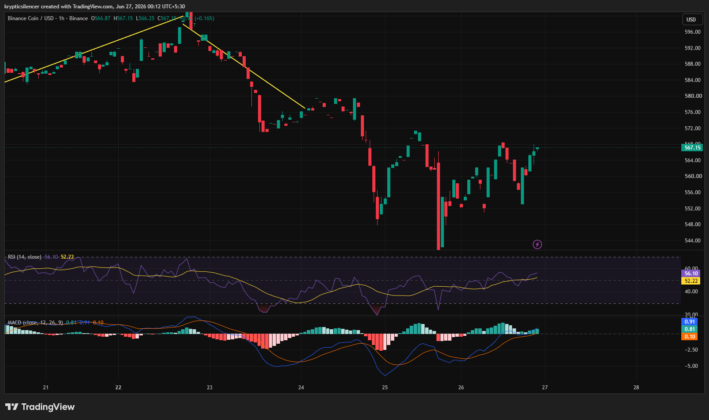

# BNB/USD — 1H Recovery Attempt Builds as Momentum Turns Constructive

**Date:** 2026-06-27
**Time:** ~00:12 IST
**Instrument:** BNBUSD
**Timeframe:** 1H
**Venue:** Binance
**Charting Platform:** TradingView

---

## Context

BNB experienced a sharp decline over the previous sessions, breaking below multiple ascending trendlines and establishing a series of lower highs. However, after finding support near recent lows, buyers have gradually regained control, allowing price to recover a significant portion of the decline.

The latest price action suggests momentum is shifting as the market attempts to establish a short-term recovery.

---

## Observation

### 1️⃣ Recovery From Local Bottom

* BNB formed a strong rebound after reacting from recent swing lows.
* Buyers have consistently defended pullbacks during the recovery.
* Price is now approaching the upper boundary of the latest recovery range.

The recent advance indicates improving short-term sentiment.

### 2️⃣ Higher Low Structure Developing

* Recent pullbacks have been shallower than earlier declines.
* Price has started printing higher lows after the initial reversal.
* This marks an improvement compared to the previous bearish structure.

Buyers are gradually strengthening market structure.

### 3️⃣ RSI Moves Above Neutral

* RSI has recovered above the 50 level.
* Momentum has shifted in favor of buyers.
* Current readings suggest improving bullish participation without entering overbought territory.

Momentum continues to improve.

### 4️⃣ MACD Turns Bullish

* MACD has crossed above the signal line.
* Histogram has transitioned into positive territory.
* Momentum expansion supports the ongoing recovery.

Technical momentum now favors buyers.

### 5️⃣ Resistance Approaching

* Price is nearing an area where previous selling pressure emerged.
* A successful breakout could strengthen the recovery.
* Rejection from this region would likely lead to another period of consolidation.

The next reaction around resistance will be critical for confirming trend continuation.

---

## Hypothesis

BNB is showing signs of short-term recovery following several sessions of sustained selling pressure.

Two conditional paths remain active:

### Scenario A — Bullish Continuation

A successful breakout above nearby resistance accompanied by strengthening momentum could extend the recovery toward higher resistance levels.

### Scenario B — Rejection at Resistance

Failure to overcome the current resistance zone may result in renewed selling pressure and another pullback toward recent support.

The current structure slightly favors buyers, but confirmation above resistance is still required.

---

## Invalidation / Confirmation

* Break above recent swing high → bullish continuation gains credibility.
* RSI remains above 50 alongside expanding MACD momentum → recovery strengthens.
* Breakdown below the latest higher low → bullish structure weakens.

---

## Notes

BNB has transitioned from a clear short-term downtrend into an improving recovery phase. Higher lows, strengthening RSI, and a bullish MACD crossover suggest momentum is shifting toward buyers. Nevertheless, nearby resistance remains the primary obstacle, and a confirmed breakout will be needed before a broader bullish reversal can be considered.

Text formatting and clarity were assisted by AI; the market analysis and structural interpretation are independently conducted by the author. This material is intended for educational and research documentation purposes only and does not constitute financial advice.
