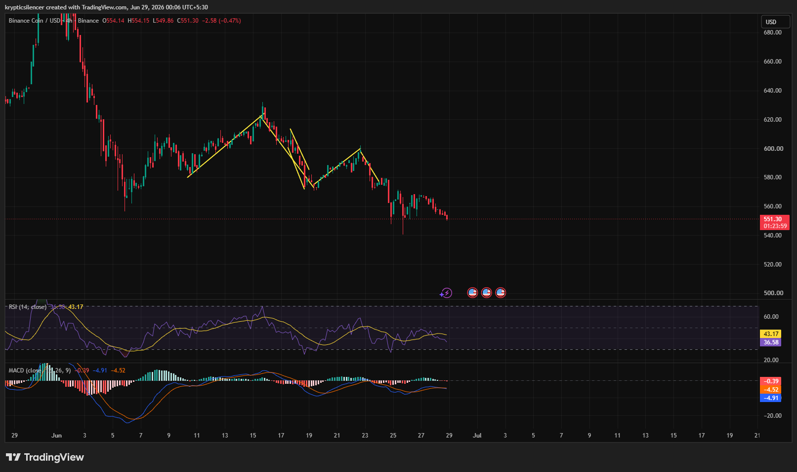

# BNB — 4H Repeated Lower Highs Continue to Favor Sellers

**Date:** 2026-06-29  
**Time:** ~00:06 IST  
**Instrument:** BNBUSD  
**Timeframe:** 4H  
**Venue:** Binance  
**Charting Platform:** TradingView  

---

## Context

BNB has remained in a sustained downtrend throughout June, with each recovery attempt failing to establish a lasting reversal. Price continues to rotate between brief relief rallies and fresh selling pressure, maintaining a bearish market structure.

The latest decline has once again pushed price toward recent lows.

---

## Observation

### 1️⃣ Series of Lower Highs

* Every recovery rally has peaked below the previous swing high.
* Trendline breakouts have repeatedly failed to develop into sustained advances.
* Sellers continue to regain control after each bounce.

The overall structure remains firmly bearish.

### 2️⃣ Weak Recovery Attempts

* Recent rebounds have been shallow compared to previous declines.
* Price continues making lower highs and lower lows.
* Buying momentum fades quickly after each rally.

This suggests buyers remain defensive rather than aggressive.

### 3️⃣ RSI Drifting Lower

* RSI has slipped back toward the mid-30 region.
* Momentum continues weakening after failing to hold above neutral levels.
* Oversold conditions have not yet triggered a meaningful reversal.

Momentum currently favors sellers.

### 4️⃣ MACD Remains Bearish

* MACD is trading below the signal line.
* Histogram remains slightly negative.
* Bearish momentum persists despite slowing downside acceleration.

Trend momentum continues to lean negative.

### 5️⃣ Support Under Pressure

* Price is revisiting an important short-term support area.
* Recent candles show limited buying interest.
* Failure to defend this region could extend the broader downtrend.

Support remains the key level to monitor.

---

## Hypothesis

BNB continues to exhibit a bearish structure characterized by repeated lower highs, weakening momentum, and unsuccessful recovery attempts.

Two conditional paths remain active:

### Scenario A — Relief Bounce

A successful defense of current support combined with improving momentum could generate another short-term recovery toward recent swing resistance.

### Scenario B — Bearish Continuation

Failure to hold support would reinforce the existing lower-high structure and increase the probability of another leg lower.

Current structure continues to favor sellers until a meaningful trend reversal develops.

---

## Invalidation / Confirmation

* Break above the latest lower high → bearish structure weakens.
* RSI recovering above neutral with strengthening MACD → recovery gains credibility.
* Breakdown below current support → bearish continuation confirmed.

---

## Notes

BNB continues to respect a well-defined bearish structure with repeated lower highs and fading recovery attempts. Momentum indicators remain weak while price tests support once again. Until buyers reclaim key resistance levels and establish higher highs, rallies are likely to remain corrective within the broader downtrend.

Text formatting and clarity were assisted by AI; the market analysis and structural interpretation are independently conducted by the author. This material is intended for educational and research documentation purposes only and does not constitute financial advice.
