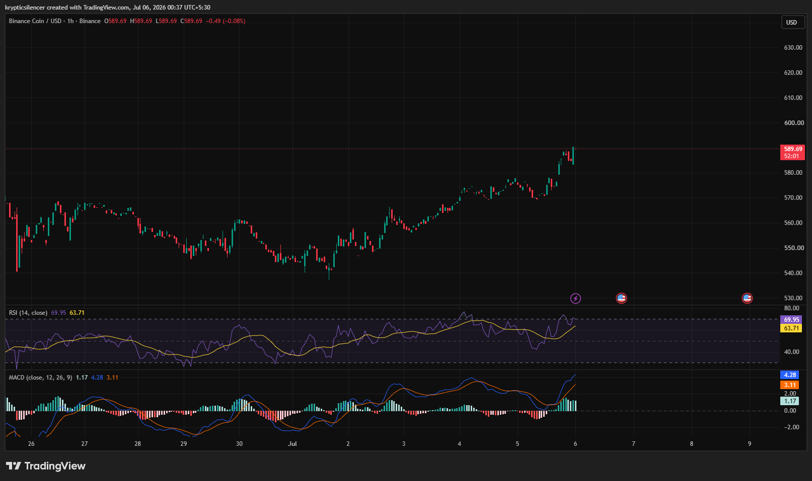

# BNB — 1H Bullish Momentum Accelerates After Breakout

**Date:** 2026-07-06  
**Time:** ~00:38 IST  
**Instrument:** BNBUSD  
**Timeframe:** 1H  
**Venue:** Binance  
**Charting Platform:** TradingView  

---

## Context

BNB has continued its steady recovery over the past several sessions, transitioning from a period of sideways movement into a sustained bullish advance. Buyers have consistently defended pullbacks, allowing price to establish a sequence of higher highs and higher lows.

The latest rally has pushed BNB toward the upper end of its recent range with momentum continuing to strengthen.

---

## Observation

### 1️⃣ Strong Bullish Structure

* Price continues printing higher highs and higher lows.
* Recent pullbacks have remained shallow.
* Buyers have maintained control throughout the latest advance.

The short-term trend remains firmly bullish.

### 2️⃣ Break Above Recent Resistance

* BNB has reclaimed previous swing highs.
* The breakout has been supported by strong follow-through buying.
* Former resistance may now act as support on future pullbacks.

Market structure favors continuation while this level holds.

### 3️⃣ RSI Approaches Overbought

* RSI has climbed toward the 70 level.
* Momentum remains strong but is approaching overextended conditions.
* Continued strength is bullish, though short-term consolidation cannot be ruled out.

Momentum continues to favor buyers.

### 4️⃣ MACD Confirms Bullish Expansion

* MACD remains above the signal line.
* Histogram has expanded into positive territory.
* Bullish momentum continues building after the recent breakout.

Momentum indicators remain aligned with the uptrend.

### 5️⃣ Buyers Retain Short-Term Control

* No meaningful bearish reversal structure has developed.
* Recent price action continues respecting higher support levels.
* Bulls remain in control unless support is decisively lost.

The trend remains constructive.

---

## Hypothesis

BNB continues to strengthen following its breakout, supported by improving market structure and bullish momentum indicators.

Two conditional paths remain active:

### Scenario A — Bullish Continuation

If buyers defend the recent breakout zone, BNB could continue extending toward higher resistance levels.

### Scenario B — Short-Term Consolidation

A rejection near current levels may trigger a healthy pullback toward newly established support before the broader uptrend resumes.

The current structure remains bullish while higher lows continue forming.

---

## Invalidation / Confirmation

* Hold above recent breakout support → bullish continuation strengthens.
* RSI maintaining strength with positive MACD expansion → momentum remains supportive.
* Breakdown below recent higher lows → short-term bullish structure weakens.

---

## Notes

BNB has transitioned into a strong short-term uptrend with higher highs, higher lows, and improving momentum across RSI and MACD. Although momentum is approaching overbought territory, buyers remain firmly in control while price continues holding above recent breakout levels.

Text formatting and clarity were assisted by AI; the market analysis and structural interpretation are independently conducted by the author. This material is intended for educational and research documentation purposes only and does not constitute financial advice.
