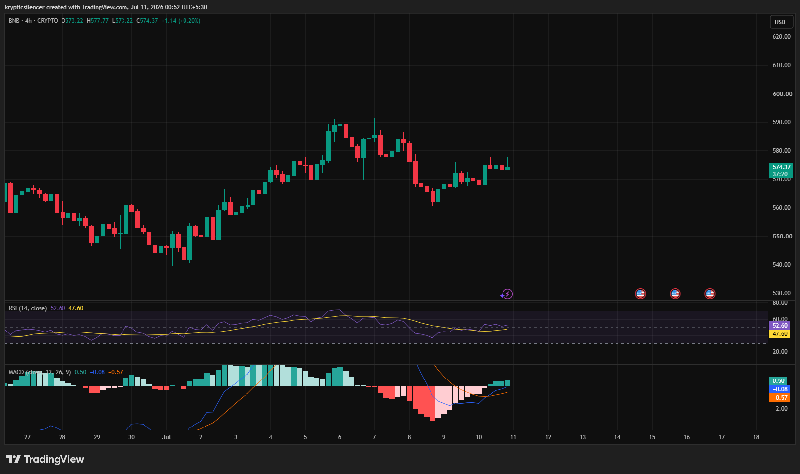

# BNB — 4H Consolidation After Recovery Signals Neutral Momentum

**Date:** 2026-07-11  
**Time:** ~00:52 IST  
**Instrument:** BNBUSD  
**Timeframe:** 4H  
**Venue:** Binance  
**Charting Platform:** TradingView  

---

## Context

BNB has recovered from its early July lows and is now consolidating around the mid-570 region. After reclaiming a significant portion of the previous decline, price has slowed, forming a relatively tight range as buyers and sellers reach temporary equilibrium.

The market is now awaiting a catalyst to determine the next directional move.

---

## Observation

### 1️⃣ Recovery Loses Momentum

* BNB recovered steadily from recent lows.
* The rally has transitioned into sideways price action.
* Recent candles show reduced volatility and balanced participation.

The market has entered a consolidation phase.

### 2️⃣ Resistance Near Recent Swing High

* Price remains below the recent peak near the 590 region.
* Buyers have yet to establish a fresh higher high.
* Multiple candles are holding just beneath resistance.

A breakout is required to resume the uptrend.

### 3️⃣ RSI Returns to Neutral

* RSI has recovered above the midline near 50.
* Momentum is neither overbought nor oversold.
* The indicator reflects a balanced market.

Momentum currently remains neutral.

### 4️⃣ MACD Turns Constructive

* MACD has crossed above the signal line.
* Histogram has shifted back into positive territory.
* Bullish momentum is gradually improving.

Momentum favors buyers, but confirmation is still limited.

### 5️⃣ Compression Before Expansion

* Price has been trading within a relatively narrow range.
* Consolidation often precedes increased volatility.
* The next breakout may determine short-term direction.

The current range is the key area to monitor.

---

## Hypothesis

BNB is consolidating after a healthy recovery while momentum indicators gradually improve.

Two conditional paths remain active:

### Scenario A — Bullish Continuation

A breakout above recent swing highs would confirm renewed buying strength and could extend the recovery.

### Scenario B — Continued Consolidation

Failure to clear resistance may keep BNB range-bound until stronger momentum develops.

Current structure is neutral with a slight bullish bias.

---

## Invalidation / Confirmation

* Break above recent swing high → bullish continuation strengthens.
* RSI remains above 50 with positive MACD → buyers retain momentum.
* Loss of recent support → consolidation weakens and bearish pressure increases.

---

## Notes

BNB has stabilized after recovering from early July weakness. RSI has returned to neutral while MACD has turned positive, suggesting momentum is improving. However, price remains below resistance, making a confirmed breakout necessary before a stronger bullish trend can be established.

Text formatting and clarity were assisted by AI; the market analysis and structural interpretation are independently conducted by the author. This material is intended for educational and research documentation purposes only and does not constitute financial advice.
