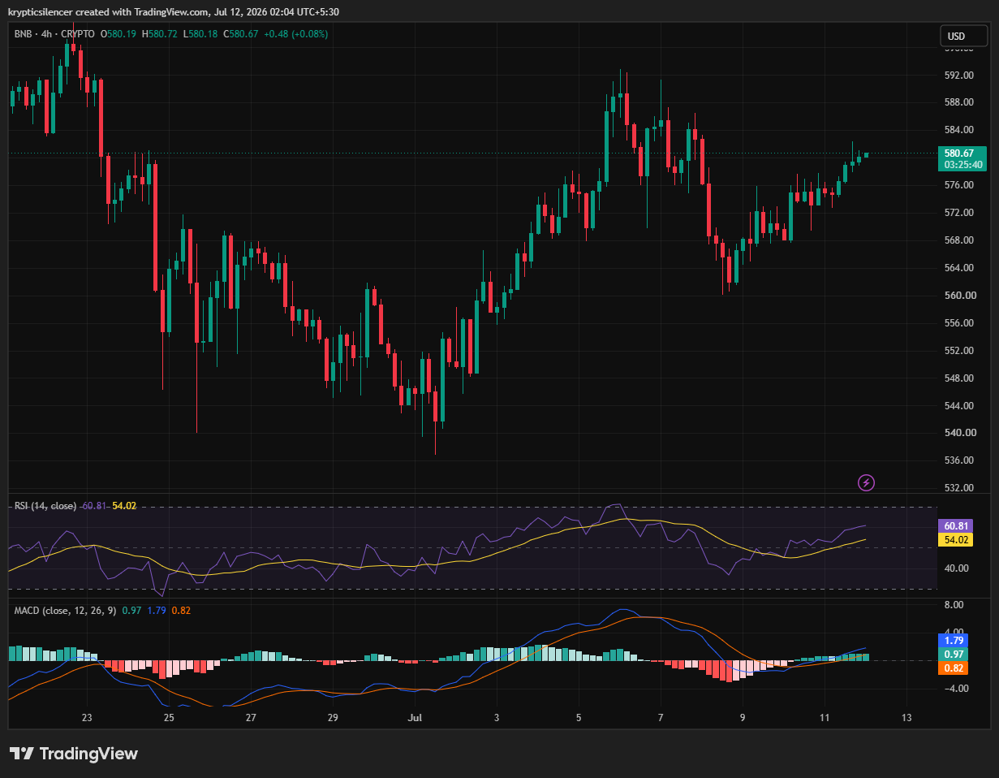

# BNB — 4H Recovery Continues as Buyers Retake Short-Term Control

**Date:** 2026-07-12  
**Time:** ~02:04 IST  
**Instrument:** BNBUSD  
**Timeframe:** 4H  
**Venue:** Binance  
**Charting Platform:** TradingView  

---

## Context

BNB continues recovering after its recent pullback, with buyers steadily reclaiming ground following the early July correction. Price has returned toward the 580 region, maintaining a sequence of higher lows while gradually rebuilding bullish momentum.

The market is approaching an important short-term resistance area that may determine whether the recovery extends further.

---

## Observation

### 1️⃣ Higher Lows Remain Intact

* Price continues forming higher lows following the recent correction.
* Buyers have consistently stepped in during pullbacks.
* Market structure remains constructive despite recent volatility.

The recovery trend remains intact.

### 2️⃣ Price Approaches Resistance

* BNB has rallied back toward the 580 region.
* Price is testing an area where sellers previously emerged.
* A decisive breakout would strengthen bullish continuation.

Resistance remains the next major obstacle.

### 3️⃣ RSI Recovers Above Neutral

* RSI has climbed back above the 50 level.
* Momentum has shifted in favor of buyers.
* The indicator remains well below overbought territory.

Momentum leaves room for additional upside.

### 4️⃣ MACD Continues Improving

* MACD remains above the signal line.
* Histogram has returned to positive territory.
* Bullish momentum continues to build gradually.

Momentum indicators support the recovery.

### 5️⃣ Buyers Regain Short-Term Control

* Recent candles show sustained buying pressure.
* Price has recovered most of the previous pullback.
* Holding above recent swing lows preserves the bullish structure.

The next confirmation comes from a breakout above resistance.

---

## Hypothesis

BNB continues to strengthen after reclaiming higher lows and improving momentum.

Two conditional paths remain active:

### Scenario A — Bullish Continuation

A breakout above recent resistance would confirm renewed buying strength and could extend the recovery toward higher price levels.

### Scenario B — Consolidation

Failure to break resistance may lead to another period of sideways movement before buyers attempt another advance.

Current structure maintains a modest bullish bias.

---

## Invalidation / Confirmation

* Break above recent swing high → bullish continuation strengthens.
* RSI remains above 50 with positive MACD → momentum stays supportive.
* Break below recent higher low → recovery structure weakens.

---

## Notes

BNB continues to recover with higher lows, improving RSI, and a constructive MACD crossover. While momentum currently favors buyers, price remains below an important resistance zone. A confirmed breakout would strengthen the bullish outlook, whereas rejection may extend the current consolidation.

Text formatting and clarity were assisted by AI; the market analysis and structural interpretation are independently conducted by the author. This material is intended for educational and research documentation purposes only and does not constitute financial advice.
