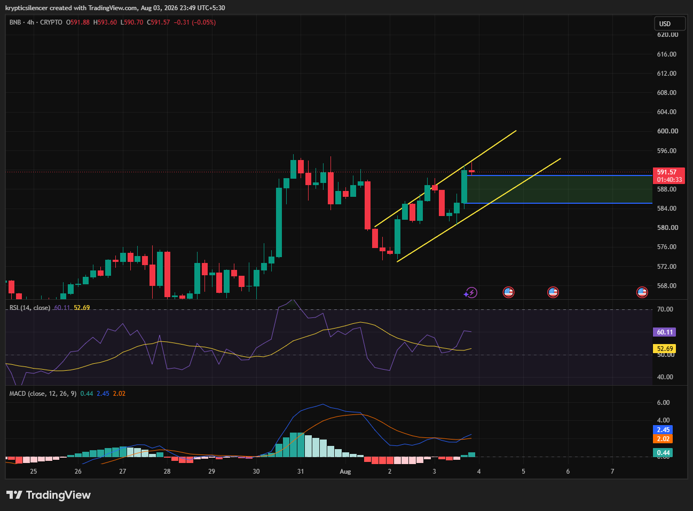

# BNB — 4H Ascending Channel Tests Resistance After Strong Recovery

**Date:** 2026-08-03  
**Time:** ~23:49 IST  
**Instrument:** BNBUSD  
**Timeframe:** 4H  
**Venue:** CRYPTO  
**Charting Platform:** TradingView  

---

## Context

BNB has rebounded strongly from recent lows, forming an ascending channel after reclaiming higher lows. Price has now reached the upper portion of the channel while approaching a nearby resistance zone, making this an important decision area.

---

## Observation

### 1️⃣ Ascending Channel Intact

* Price continues to respect both the upper and lower channel boundaries.
* Higher highs and higher lows remain intact.
* The trend remains constructive while the channel holds.

The short-term structure continues to favor buyers.

### 2️⃣ Resistance Test

* Price has rallied into the highlighted resistance zone.
* Multiple candles have stalled near this level.
* A breakout has yet to be confirmed.

This area is likely to determine the next directional move.

### 3️⃣ RSI Turns Bullish

* RSI has recovered above the 50 level.
* Momentum has shifted back in favor of buyers.
* The indicator remains below overbought territory, leaving room for further upside.

Momentum supports the ongoing recovery.

### 4️⃣ MACD Bullish Crossover

* MACD has crossed above the signal line.
* Histogram has turned positive.
* Bullish momentum is beginning to strengthen again.

Momentum indicators align with the recent price recovery.

---

## Hypothesis

BNB is attempting a bullish continuation within its ascending channel.

Two scenarios remain likely:

### Scenario A — Bullish Breakout

A confirmed close above resistance and the upper channel would strengthen the bullish trend and increase the probability of continuation toward higher levels.

### Scenario B — Channel Rejection

Failure to break resistance could trigger a pullback toward the lower boundary of the channel, where buyers may attempt to defend trend support.

---

## Invalidation / Confirmation

* Sustained breakout above resistance with increasing volume → bullish continuation confirmed.
* Breakdown below the ascending channel → bullish structure weakens.
* RSI holding above 50 alongside a strengthening MACD histogram would reinforce the bullish case.

---

## Notes

BNB has recovered well and remains inside a healthy ascending channel. Both RSI and MACD favor buyers, but price is now testing an important resistance area. Whether buyers achieve a breakout or face rejection here will likely define the next major move.

Text formatting and clarity were assisted by AI; the market analysis and structural interpretation are independently conducted by the author. This material is intended for educational and research documentation purposes only and does not constitute financial advice.
