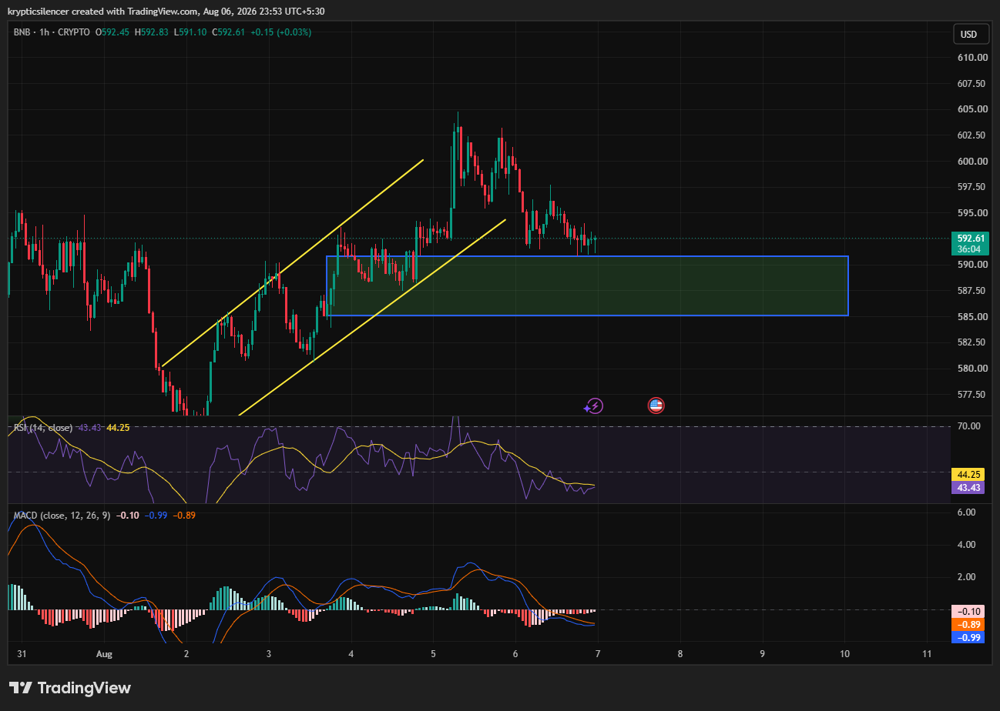

# BNB — 1H Pullback Tests Former Resistance as New Support

**Date:** 2026-08-06  
**Time:** ~23:54 IST  
**Instrument:** BNBUSD  
**Timeframe:** 1H  
**Venue:** CRYPTO  
**Charting Platform:** TradingView  

---

## Context

BNB broke out from a rising channel before rallying toward the $600 region. After rejection near local highs, price has retraced into a highlighted demand zone that coincides with the previous breakout area. This region is now acting as the first key support.

---

## Observation

### 1️⃣ Breakout Retest

* Price has returned to the previous breakout level.
* The highlighted demand zone continues to attract buyers.
* Candles are stabilizing above support rather than breaking below it.

The breakout remains technically valid while support holds.

### 2️⃣ Loss of Short-Term Momentum

* Recent candles show lower highs after the rejection from $600.
* Buying pressure has slowed.
* The market is transitioning into consolidation.

Momentum has cooled following the impulsive rally.

### 3️⃣ RSI Near Neutral-Bearish

* RSI has slipped below the 50 level.
* Momentum favors neither buyers nor sellers decisively.
* Continued recovery above 50 would improve the bullish outlook.

RSI reflects weakening short-term strength.

### 4️⃣ MACD Remains Soft

* MACD trades below the signal line.
* Histogram remains slightly negative.
* Bearish momentum appears to be fading rather than accelerating.

Momentum indicators suggest consolidation instead of a strong trend.

---

## Hypothesis

BNB is testing an important support zone after completing a healthy pullback.

Two scenarios remain likely:

### Scenario A — Bullish Rebound

Holding above the demand zone followed by a higher high would indicate buyers are defending the breakout and could lead to another attempt at the recent highs.

### Scenario B — Support Failure

A decisive breakdown below the highlighted support would invalidate the breakout structure and increase the probability of a deeper correction.

---

## Invalidation / Confirmation

* Strong bullish candles from the support zone with rising volume → bullish continuation strengthens.
* Sustained close below support → bearish scenario gains credibility.
* RSI reclaiming 50 alongside a bullish MACD crossover would support renewed upside.

---

## Notes

BNB is currently retesting a key support area after failing to hold above $600. The broader structure remains constructive, but momentum indicators have weakened. The reaction at this demand zone is likely to determine whether the pullback ends here or develops into a deeper correction.

Text formatting and clarity were assisted by AI; the market analysis and structural interpretation are independently conducted by the author. This material is intended for educational and research documentation purposes only and does not constitute financial advice.
