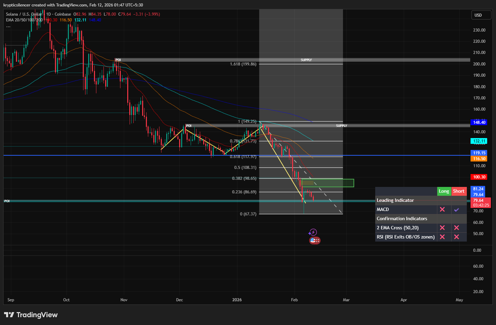

# Solana — 1D Downtrend Continuation & Rebalancing Phase

**Date:** 2026-02-12  
**Time:** ~01:45 IST  
**Instrument:** SOLUSD  
**Timeframe:** 1D  
**Venue:** Coinbase  
**Charting Platform:** TradingView  

---

## Context

Solana has broken below prior structural lows, confirming continuation of the daily downtrend.  
The market is currently trading beneath all major moving averages, reinforcing bearish higher-timeframe control.

The recent impulsive sell-off created a visible imbalance (Fair Value Gap), followed by sideways compression.

---

## Observation

- **Market Structure:**  
  Clear sequence of lower highs and lower lows. The break of prior support confirms trend continuation.

- **Fair Value Gap (FVG):**  
  The impulsive move lower left an inefficiency (highlighted zone). Price is currently consolidating beneath this area, suggesting ongoing rebalancing.

- **Sideways Compression:**  
  Post-impulse movement is overlapping and range-bound, indicating temporary equilibrium rather than immediate continuation.

- **Momentum (RSI):**  
  RSI is in oversold territory, signaling momentum exhaustion risk. However, oversold conditions alone do not imply reversal without structural shift.

---

## Hypothesis

The broader bias remains **bearish** following the confirmed break of lower lows.

Two conditional paths emerge:

### Scenario 1 — Corrective Breakout
If price reclaims the green FVG zone and receives sustained acceptance, a corrective push toward higher resistance levels becomes possible.

### Scenario 2 — Continuation
Failure to break and hold above the FVG increases the probability of renewed downside expansion, maintaining the dominant downtrend structure.

---

## Invalidation / Failure Mode

- Acceptance above the FVG and reclaim of prior lower high  
- Sustained movement above key moving averages  
- Structural higher high formation on the daily timeframe  

---

## Notes

This analysis documents a **downtrend continuation with short-term rebalancing** rather than confirmed reversal.

Text formatting and clarity were assisted by AI; the market analysis, chart interpretation, and structural assessment are independently conducted by the author.  
This material is intended for educational and research documentation purposes only and does not constitute financial advice.
