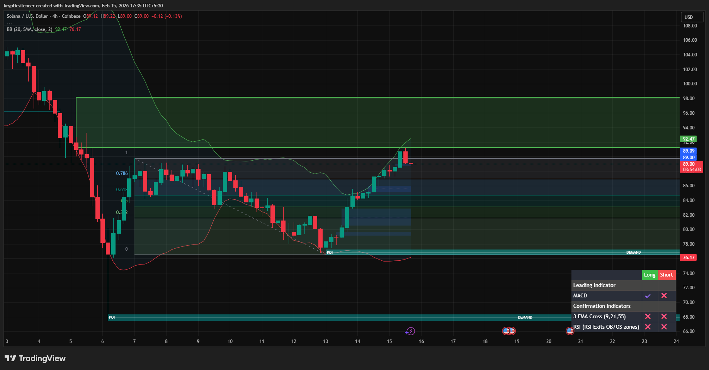

# Solana — 4H Retracement Into Supply Zone

**Date:** 2026-02-15  
**Time:** ~17:35 IST  
**Instrument:** SOLUSD  
**Timeframe:** 4H  
**Venue:** Coinbase  
**Charting Platform:** TradingView  

---

## Context

Solana reacted strongly from a defined demand zone (~76 region), initiating a sharp recovery leg.  
Price is now retracing upward into a higher-timeframe supply zone after completing a measured Fibonacci retracement of the prior downswing.

The broader structure remains corrective within a larger bearish regime.

---

## Observation

- **Demand Reaction:**  
  Strong impulse originated from the lower demand area, suggesting temporary exhaustion of selling pressure.

- **Fibonacci Structure:**  
  Price has retraced through the 0.382, 0.5, and 0.618 levels, approaching the 0.786 retracement — a region often associated with deeper corrective rallies.

- **Supply Overhead:**  
  A major supply zone (highlighted in green) sits above current price (~89–98 region), acting as the primary resistance cluster.

- **Momentum:**  
  Recovery has been directional but remains beneath higher-timeframe resistance. Indicators show improvement but not full structural shift.

- **Range Dynamics:**  
  Current movement resembles a corrective leg rather than impulsive breakout behavior.

---

## Hypothesis

Price is interacting with a key resistance decision zone.

Two conditional scenarios:

### Scenario 1 — Rejection
Failure to gain acceptance inside the supply zone may result in rotation back toward mid-range or demand support.

### Scenario 2 — Break & Acceptance
Sustained acceptance above the 0.786 retracement and inside supply would increase probability of testing upper supply boundaries.

Until structural higher highs are confirmed, this remains a corrective advance within a broader bearish context.

---

## Invalidation / Failure Mode

- Strong breakout with acceptance above supply  
- Formation of higher high on 4H  
- Sustained bullish momentum expansion  

---

## Notes

This analysis documents a corrective retracement into higher-timeframe supply following demand reaction.

Text formatting and clarity were assisted by AI; the market analysis, structural interpretation, and scenario assessment are independently conducted by the author.  
This material is intended for educational and research documentation purposes only and does not constitute financial advice.
