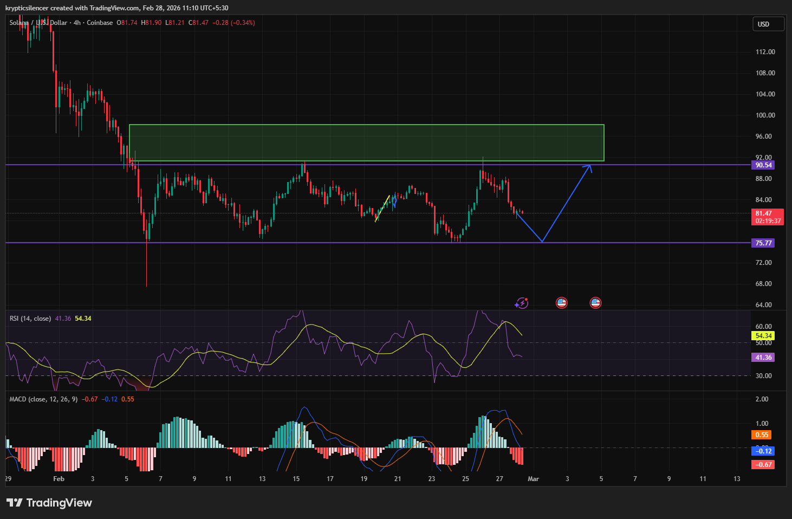

# Solana — 4H Triple Top Under FVG Resistance

**Date:** 2026-02-28  
**Time:** ~11:10 IST  
**Instrument:** SOLUSD  
**Timeframe:** 4H  
**Venue:** Coinbase  
**Charting Platform:** TradingView  

---

## Context

Solana remains range-bound after a prior downside expansion.  
Price has been rotating between defined horizontal support and resistance, failing to establish sustained higher highs.

Current structure shows compression beneath a major overhead imbalance (green FVG).

---

## Observation

### 1️⃣ Triple Top Formation
- Three clear rejections near the same resistance level (~90.5 region).
- Upper wicks showing repeated supply absorption.
- No decisive close above resistance.

This confirms strong overhead supply at the bottom of the green FVG.

### 2️⃣ Triple Bottom Support
- Horizontal demand holding near ~75.7 region.
- Multiple reactions from the same base level.
- Range structure clearly defined.

Market currently oscillating within this box.

### 3️⃣ Indicator Confluence
- MACD bearish cross forming after histogram rollover.
- RSI cross downward from mid-to-upper range.
- Momentum weakening near resistance.

Momentum aligns with structural rejection.

### 4️⃣ FVG Interaction
- Price failing to enter and accept inside the green fair value gap.
- Bottom of FVG acting as dynamic resistance.
- Lack of imbalance fill suggests sellers defending premium.

---

## Hypothesis

Range remains intact unless a decisive breakout occurs.

Two conditional paths:

### Scenario A — Rejection & Rotation Lower
Failure to reclaim FVG resistance increases probability of rotation back toward range lows (~75.7 support).

### Scenario B — Break & Imbalance Fill
Strong displacement above triple top resistance would invalidate range thesis and open continuation into FVG.

Until breakout occurs, structure favors range rotation.

---

## Invalidation / Confirmation

- 4H close above triple top + FVG acceptance → bullish breakout.
- Lower high beneath resistance → bearish rotation toward support.

---

## Notes

This setup documents a clear range environment with triple top resistance, triple bottom support, and momentum indicators aligning with resistance rejection.

Text formatting and clarity were assisted by AI; the market analysis and structural interpretation are independently conducted by the author.  
This material is intended for educational and research documentation purposes only and does not constitute financial advice.
