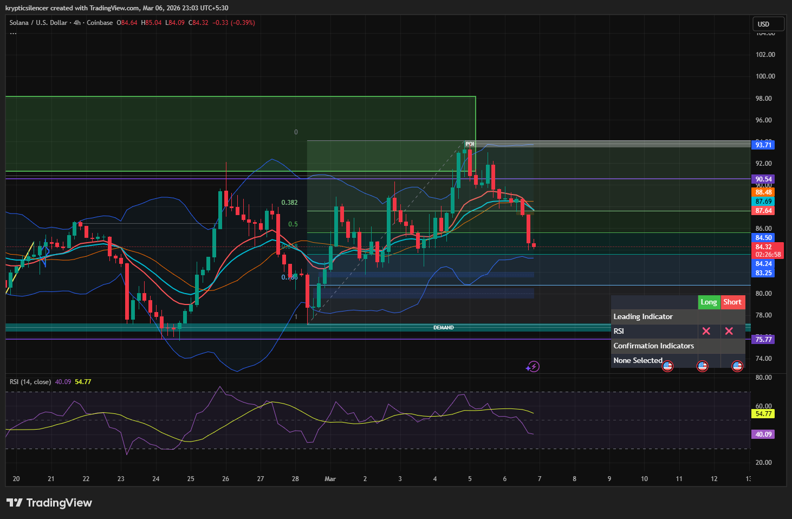

# Solana — 4H Mean Reversion Watch Near Lower Bollinger Band

**Date:** 2026-03-06  
**Time:** ~23:00 IST  
**Instrument:** SOLUSD  
**Timeframe:** 4H  
**Venue:** Coinbase  
**Charting Platform:** TradingView  

---

## Context

Solana recently rejected from higher timeframe resistance after an impulsive rally from demand.  
Following the rejection, price has begun rotating lower within the retracement range.

The market is currently approaching deeper discount levels where volatility compression may trigger a reaction.

---

## Observation

### 1️⃣ Corrective Decline
- Price rejected near premium levels around the recent swing high.
- Consecutive bearish candles indicate short-term corrective structure.
- Market rotating toward lower range support.

### 2️⃣ Bollinger Band Position
- Price trending toward the lower Bollinger Band.
- Lower band interactions often signal short-term volatility exhaustion.
- Potential reaction zone if price tags the lower band.

### 3️⃣ RSI Momentum
- RSI currently near **40**, indicating weakening bullish momentum.
- Momentum cooling but not yet in oversold territory.
- Room for continuation before potential reversal.

### 4️⃣ Structural Support
- Prior demand zone located below current price.
- Retracement approaching equilibrium-to-discount region of the recent impulse.
- Potential reaction zone forming near lower volatility boundary.

---

## Hypothesis

Current structure suggests continuation of the corrective move until volatility support is tested.

Two conditional paths:

### Scenario A — Mean Reversion Bounce
If price tags the **lower Bollinger Band**, a short-term reversal toward equilibrium or mid-band may occur.

### Scenario B — Deeper Discount Rotation
Failure to react near the lower band could push price toward deeper demand levels before stabilization.

Until volatility support is reached, downside rotation remains possible.

---

## Invalidation / Confirmation

- Strong bullish reaction near lower Bollinger Band → mean reversion bounce confirmed.
- Breakdown below local support → continuation toward demand zone.

---

## Notes

This setup highlights a corrective phase following a rejection from premium levels, with attention on the lower Bollinger Band as a potential mean reversion trigger.

Text formatting and clarity were assisted by AI; the market analysis and structural interpretation are independently conducted by the author.  
This material is intended for educational and research documentation purposes only and does not constitute financial advice.
