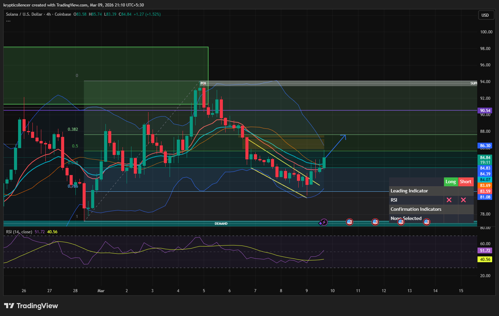

# Solana — 4H Parallel Channel Bounce, Bullish Continuation Watch

**Date:** 2026-03-09  
**Time:** ~21:10 IST  
**Instrument:** SOLUSD  
**Timeframe:** 4H  
**Venue:** Coinbase  
**Charting Platform:** TradingView  

---

## Context

Solana recently rejected from higher timeframe supply and entered a corrective decline.  
The correction developed within a **descending parallel channel**, indicating controlled bearish structure rather than impulsive breakdown.

Price is now reacting near the lower boundary of the channel.

---

## Observation

### 1️⃣ Parallel Channel Structure
- Price action forming a **clear descending channel**.
- Lower highs and lower lows respecting the channel boundaries.
- Current candle reacting near the lower channel support.

Channel dynamics often lead to relief bounces within the structure.

### 2️⃣ Bollinger Band Reaction
- Price tagged the **lower Bollinger Band** during the decline.
- Lower band reactions often precede short-term reversals.
- Current candle showing early signs of bullish recovery.

### 3️⃣ Fibonacci Interaction
- Recent impulse from demand created a retracement structure.
- Price currently holding near the **0.786 / discount region**.
- Bounce could target the next Fibonacci level around **0.382–0.5 retracement**.

### 4️⃣ Momentum Condition
- RSI recovering from lower levels (~40–50 region).
- Momentum gradually turning upward after oversold conditions.

---

## Hypothesis

Reaction from channel support suggests potential bullish continuation toward higher retracement levels.

Two conditional paths:

### Scenario A — Channel Bounce
Price holds channel support and moves upward toward the next Fibonacci level and channel midline.

### Scenario B — Channel Breakdown
Failure to hold channel support may trigger continuation toward deeper demand below.

As long as the channel base holds, short-term bullish reaction remains probable.

---

## Invalidation / Confirmation

- Higher low formation above channel support → bounce continuation.
- Breakdown below channel base → deeper corrective move.

---

## Notes

This setup highlights a controlled correction within a parallel channel, where price reaction at the lower boundary suggests a potential move toward the next Fibonacci retracement level.

Text formatting and clarity were assisted by AI; the market analysis and structural interpretation are independently conducted by the author.  
This material is intended for educational and research documentation purposes only and does not constitute financial advice.
