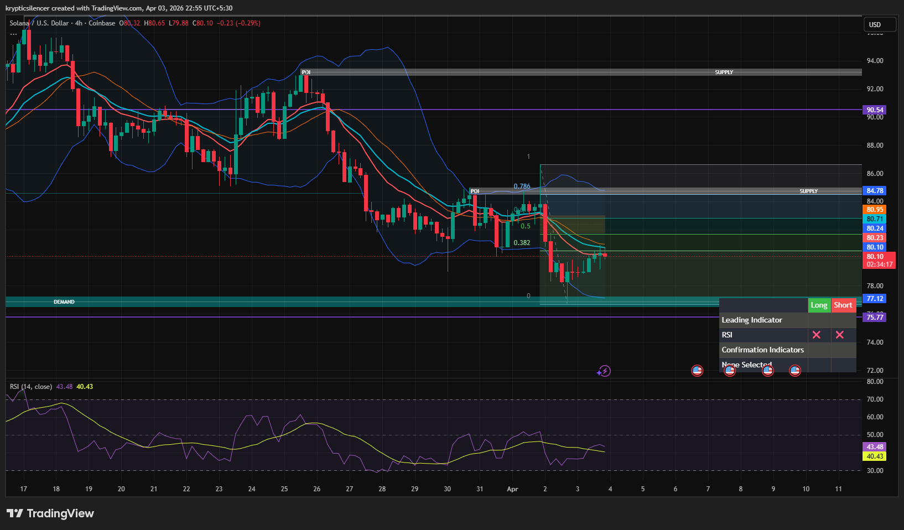

# Solana — 4H Pullback Into Supply After Bearish Impulse

**Date:** 2026-04-03  
**Time:** ~22:55 IST  
**Instrument:** SOLUSD  
**Timeframe:** 4H  
**Venue:** Coinbase  
**Charting Platform:** TradingView  

## Context

Solana remains in a clear downtrend on the 4H timeframe, with price trading below key moving averages and respecting a sequence of lower highs and lower lows.

The recent move shows a strong impulsive sell-off into a demand zone, followed by a corrective pullback. The current price action appears to be a retracement rather than a confirmed reversal.

---

## Observation

- **Market Structure:**  
  Bearish structure remains intact with continued lower highs and lower lows. The recent rally appears corrective within the broader downtrend.

- **Fibonacci Retracement:**  
  Price retraced into the 0.5–0.618 retracement zone, a common area for lower high formation in a bearish trend.

- **Supply Zone:**  
  Overhead supply and prior POI align near the retracement region, creating a confluence resistance area.

- **Demand Zone Reaction:**  
  The impulsive move originated from a demand zone (~77), and current price is reacting after the bounce from this level.

- **Momentum (RSI):**  
  RSI remains below 50, indicating bearish momentum still dominates despite the short-term bounce.

---

## Hypothesis

The primary bias remains **bearish** as long as price stays below the supply zone.

Two conditional paths:

### Scenario 1 — Lower High Formation (Bearish Continuation)
If price rejects from the 0.5–0.618 retracement region and forms a lower high, then continuation toward the demand zone (~77) is likely.

### Scenario 2 — Deeper Retracement
If price breaks above the immediate retracement resistance, price may move higher into the next supply zone (~84.7) before any further downside continuation.

---

## Invalidation / Failure Mode

- Break and hold above the higher supply zone (~84.7)  
- Formation of a higher high on the 4H timeframe  
- Sustained movement above key moving averages  

---

## Notes

This analysis documents a **bearish continuation setup with a corrective pullback into supply**, not a confirmed trend reversal.

Text formatting and clarity were assisted by AI; the market analysis, chart interpretation, and structural assessment are independently conducted by the author.  
This material is intended for educational and research documentation purposes only and does not constitute financial advice.
