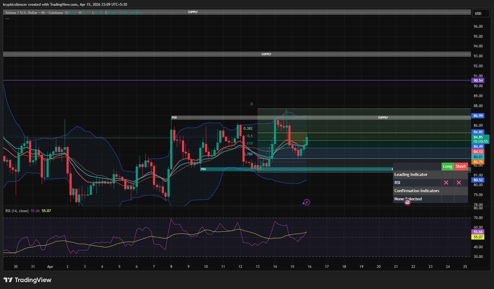

# Solana — 4H Bullish Move Into Supply

**Date:** 2026-04-15  
**Time:** ~23:09 IST  
**Instrument:** SOLUSD  
**Timeframe:** 4H  
**Venue:** Coinbase  
**Charting Platform:** TradingView  

---

## Context

Solana is showing a recovery after previously trading in a corrective structure. Price has bounced from a demand/POI zone and is now moving upward, indicating a short-term bullish phase within a broader context.

---

## Observation

- **Market Structure:**  
  Short-term structure is shifting bullish with formation of higher lows and upward movement.

- **Bullish Move:**  
  Price has shown a steady bullish push from the demand zone (~82 area), indicating buying interest.

- **Fibonacci Retracement:**  
  Price is holding above the 0.5–0.618 region, supporting continuation toward higher levels.

- **Supply Zone:**  
  Price is currently moving toward a key supply zone (~86.9), where reaction is expected.

- **Momentum (RSI):**  
  RSI is trending upward above midline, indicating strengthening bullish momentum.

---

## Hypothesis

The market is in a **short-term bullish move toward supply**.

Two conditional paths:

### Scenario 1 — Supply Reaction
If price reacts from the supply zone, a pullback or consolidation may occur.

### Scenario 2 — Breakout Continuation
If price breaks and holds above supply, further bullish continuation may follow.

---

## Invalidation / Failure Mode

- Breakdown below recent higher low  
- Loss of 0.5 retracement support  
- RSI dropping below midline  

---

## Notes

This analysis documents a **bullish move into supply**, not a confirmed breakout or higher timeframe trend reversal.

Text formatting and clarity were assisted by AI; the market analysis, chart interpretation, and structural assessment are independently conducted by the author.  
This material is intended for educational and research documentation purposes only and does not constitute financial advice.
