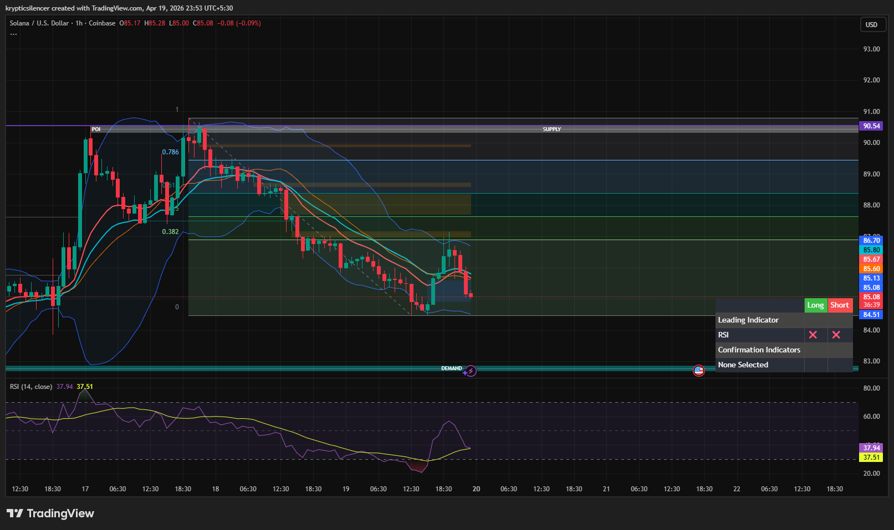

# Solana — 1H Return to Range Low With Potential Bounce

**Date:** 2026-04-19  
**Time:** ~23:53 IST  
**Instrument:** SOLUSD  
**Timeframe:** 1H  
**Venue:** Coinbase  
**Charting Platform:** TradingView  

---

## Context

Solana has been in a short-term downtrend after rejecting from higher levels. Price is now approaching the lower boundary of the range (0 level), where previous demand has been observed.

---

## Observation

- **Market Structure:**  
  Bearish short-term structure with lower highs and lower lows leading into range lows.

- **Return to Range Low:**  
  Price has moved back toward the 0 level of the recent range, an area typically associated with demand.

- **Downward Momentum:**  
  The move down has been steady, but signs of slowing are beginning to appear near support.

- **Demand Zone:**  
  A key demand zone sits just below current price (~83–84), where prior reactions occurred.

- **Momentum (RSI):**  
  RSI is in lower territory, indicating oversold conditions and potential for a bounce.

---

## Hypothesis

The market is at a **potential reaction zone near range lows**.

Two conditional paths:

### Scenario 1 — Bounce From Demand
If price holds the 0 level and demand zone, a short-term bounce toward mid-range is likely.

### Scenario 2 — Breakdown
If price breaks below demand with acceptance, continuation to the downside may follow.

---

## Invalidation / Failure Mode

- Strong breakdown below demand zone  
- Continued formation of lower lows  
- RSI remaining weak without recovery  

---

## Notes

This analysis documents a **return to range lows with potential for a short-term bounce**, not a confirmed trend reversal.

Text formatting and clarity were assisted by AI; the market analysis, chart interpretation, and structural assessment are independently conducted by the author.  
This material is intended for educational and research documentation purposes only and does not constitute financial advice.
