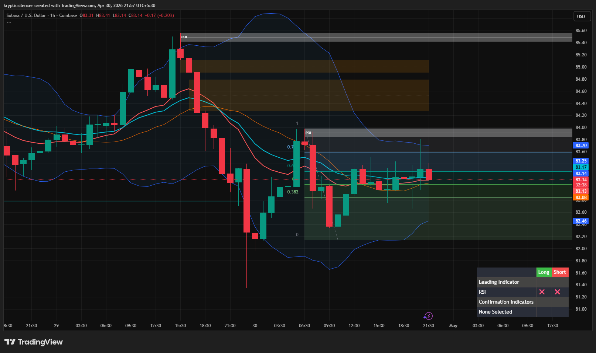

# Solana — 1H Compression Below Local Resistance

**Date:** 2026-04-30  
**Time:** ~21:55 IST  
**Instrument:** SOLUSD  
**Timeframe:** 1H  
**Venue:** Coinbase  
**Charting Platform:** TradingView  

---

## Context

Solana is stabilizing after a sharp sell-off and local recovery, now trading in a compressed range beneath short-term resistance.

Price has reclaimed local lows, but upside continuation remains capped by overhead supply.

---

## Observation

- **Market Structure:**  
  Short-term recovery from the local low, followed by sideways consolidation.

- **Compression:**  
  Price is moving in a tight range with overlapping candles, indicating temporary equilibrium and reduced volatility.

- **Resistance Overhead:**  
  SOL remains capped below the local supply zone, with repeated rejection near resistance.

- **Momentum (RSI):**  
  RSI is neutral and flattening, reflecting weak momentum and lack of immediate directional conviction.

---

## Hypothesis

Solana is compressing beneath resistance, with the next move likely determined by breakout direction.

### Scenario 1 — Bullish Break
If price reclaims local resistance and holds above the compression range, continuation toward higher supply becomes likely.

### Scenario 2 — Bearish Rejection
Failure to break resistance increases the probability of rotation back toward local support and lower demand.

---

## Invalidation / Failure Mode

- Strong breakout with no follow-through  
- Immediate rejection after reclaim attempt  
- Continued sideways chop inside the current range  

---

## Notes

This setup reflects **short-term compression below resistance**, not a confirmed breakout yet.

Text formatting and clarity were assisted by AI; the market analysis, chart interpretation, and structural assessment are independently conducted by the author.  
This material is intended for educational and research documentation purposes only and does not constitute financial advice.
