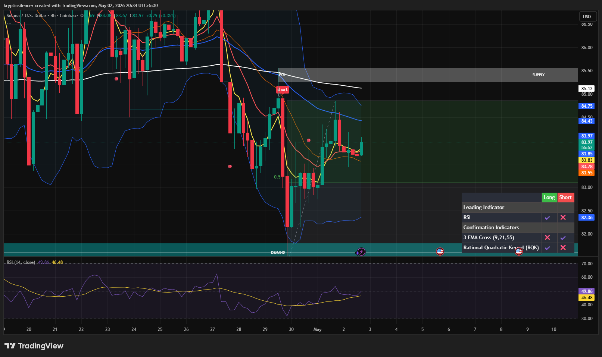

# Solana — 4H Bullish Rebound From Demand

**Date:** 2026-05-02  
**Time:** ~20:30 IST  
**Instrument:** SOLUSD  
**Timeframe:** 4H  
**Venue:** Coinbase  
**Charting Platform:** TradingView  

---

## Context

Solana has reacted strongly from the lower demand zone after a sharp downside sweep, printing a clean bullish rebound on the 4H timeframe.

Price is now recovering through local structure, suggesting short-term momentum has shifted in favor of buyers.

---

## Observation

- **Market Structure:**  
  Strong bullish recovery from demand following a sharp sell-side flush.

- **Demand Reaction:**  
  Price tapped the lower demand zone and immediately printed aggressive upside response, confirming buyer presence.

- **Recovery Structure:**  
  SOL has reclaimed local intraday levels and is now attempting continuation into higher resistance.

- **Momentum (RSI):**  
  RSI has recovered from weak conditions and is now turning upward, supporting bullish short-term momentum.

---

## Hypothesis

Solana has shifted bullish in the short term after the strong demand reaction.

### Scenario 1 — Continuation
If price holds above reclaimed local structure, continuation toward overhead supply becomes likely.

### Scenario 2 — Rejection
Failure to sustain above current levels may trigger a short-term retrace into local support before continuation.

---

## Invalidation / Failure Mode

- Loss of reclaimed local structure  
- Sharp rejection with no follow-through  
- Breakdown back into lower demand zone  

---

## Notes

This setup reflects a **strong bullish rebound from demand**, with short-term momentum favoring continuation unless local structure fails.

Text formatting and clarity were assisted by AI; the market analysis, chart interpretation, and structural assessment are independently conducted by the author.  
This material is intended for educational and research documentation purposes only and does not constitute financial advice.
