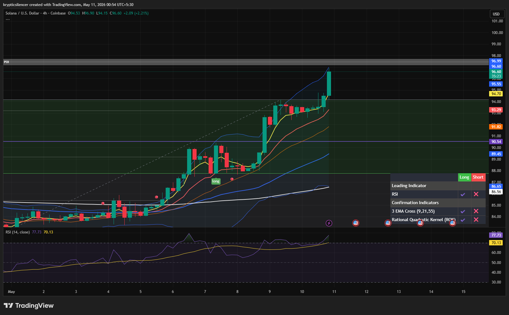

# Solana 4H — Extended Rally Into Supply

**Date:** 2026-05-11  
**Time:** 00:54 IST  
**Instrument:** SOLUSD  
**Timeframe:** 4H  
**Platform:** TradingView  

---

## Context

Solana has printed a strong impulsive bullish expansion after reclaiming higher timeframe structure. Price is now approaching a major supply zone while leaving behind a large fair value gap (FVG), increasing the probability of short-term rebalancing.

---

## Observation

- **Market Structure:**  
Strong bullish continuation with consecutive higher highs and higher lows.

- **Momentum Expansion:**  
Recent candles show aggressive buyer strength with steep upward acceleration into supply.

- **Fair Value Gap (FVG):**  
A massive imbalance has formed beneath current price, which may attract short-term retracement for liquidity rebalancing.

- **Supply Interaction:**  
Price is trading directly below higher timeframe supply near the previous rejection zone.

- **RSI Behavior:**  
RSI is entering overextended territory, suggesting momentum remains bullish but locally overheated.

---

## Hypothesis

The broader structure remains bullish, but short-term conditions favor a possible cooldown move before continuation.

### Scenario 1 — Bearish Retracement
Price may retrace into the FVG / mid-range region to rebalance inefficiencies before attempting another expansion higher.

### Scenario 2 — Bullish Continuation
If momentum remains aggressive and supply breaks cleanly, continuation toward higher resistance becomes likely without deep retracement.

---

## Invalidation / Failure Case

- Strong bearish rejection from supply  
- Breakdown below key EMA support cluster  
- Loss of bullish market structure  
- RSI sharply collapsing from overbought conditions  

---

## Notes

This setup reflects strong bullish momentum with temporary overextension.  
Short-term bearish movement would currently be considered corrective unless major support levels fail.
