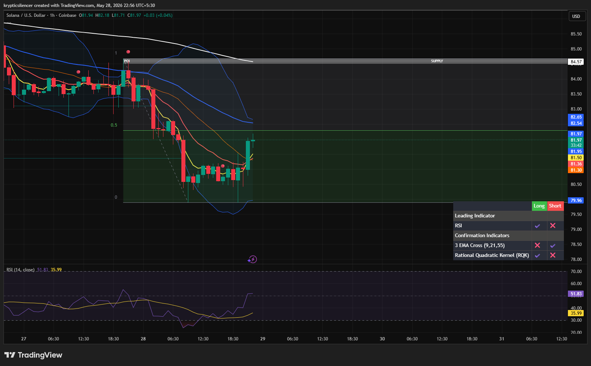

# Solana — 1H Sideways Compression Before Bullish Recovery Attempt

**Date:** 2026-05-28
**Time:** ~22:56 IST
**Instrument:** SOLUSD
**Timeframe:** 1H
**Venue:** Coinbase
**Charting Platform:** TradingView

---

## Context

Solana spent multiple sessions consolidating within a tight sideways range after a sharp bearish expansion from higher timeframe supply.
Recent price action now shows early signs of bullish recovery momentum emerging from local support.

---

## Observation

* **Range Compression:**
  Price remained trapped in a narrow sideways structure following the impulsive selloff.

* **Bullish Reaction:**
  Buyers stepped in strongly near the local low, producing a clean bullish expansion candle.

* **EMA Interaction:**
  Short-term EMAs are beginning to flatten after prolonged bearish alignment, suggesting weakening downside momentum.

* **Momentum Shift:**
  RSI recovered from oversold territory and is now rotating upward toward neutral levels.

* **Supply Positioning:**
  Price still remains below the higher timeframe supply zone and major resistance overhead.

---

## Hypothesis

SOL may be transitioning from bearish compression into an early-stage recovery phase while holding above local support.

Two conditional paths:

### Scenario A — Bullish Continuation

Sustained acceptance above the current consolidation range may lead to continuation toward the overhead supply region.

### Scenario B — Rejection & Rotation

Failure to maintain momentum could send price back into range consolidation or another downside sweep.

---

## Invalidation / Confirmation

* Strong reclaim above local resistance → bullish continuation strengthens.
* Loss of consolidation support → bearish continuation risk increases.

---

## Notes

This setup reflects a potential transition from sideways consolidation into bullish recovery momentum following prolonged compression near local lows.

Text formatting and clarity were assisted by AI; the market analysis and structural interpretation are independently conducted by the author.
This material is intended for educational and research documentation purposes only and does not constitute financial advice.
