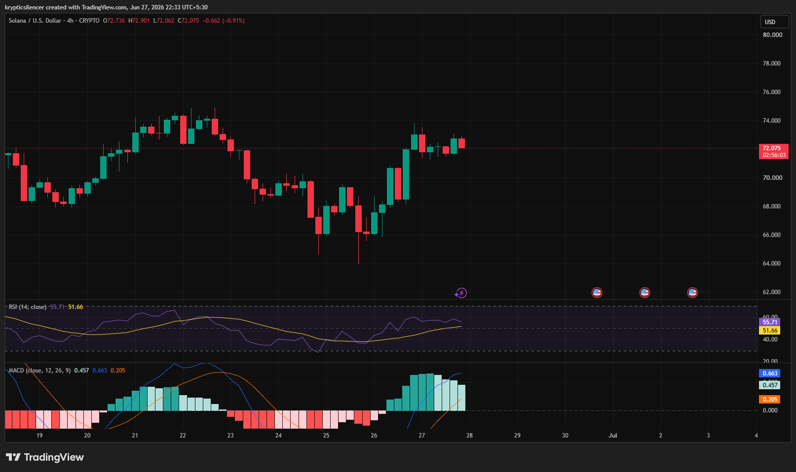

# SOL/USD — 4H Recovery Meets Resistance After Strong Momentum Shift

**Date:** 2026-06-27
**Time:** ~22:33 IST
**Instrument:** SOLUSD
**Timeframe:** 4H
**Venue:** Crypto
**Charting Platform:** TradingView

---

## Context

Solana has recovered strongly after rebounding from recent swing lows, reversing a large portion of the previous decline. The recent advance has been driven by sustained buying pressure, allowing price to reclaim multiple short-term resistance levels.

Following the rally, price has entered a period of consolidation just below recent highs as buyers and sellers battle for near-term control.

---

## Observation

### 1️⃣ Strong Recovery From Recent Lows

* SOL rallied sharply after finding support near the $66 region.
* Consecutive bullish candles pushed price back above previous consolidation levels.
* Buyers successfully reclaimed short-term market control.

The recent advance reflects a meaningful improvement in momentum.

### 2️⃣ Consolidation Near Local Resistance

* Price is now trading around the $72 region after the recovery.
* Recent candles show reduced volatility and tighter price action.
* Neither buyers nor sellers have established a decisive breakout.

The market is entering a decision phase following the impulsive rally.

### 3️⃣ RSI Holds Above Neutral

* RSI has recovered above the 50 level.
* Momentum remains constructive despite the recent pause.
* Current readings suggest buyers continue to maintain a slight advantage.

Momentum remains supportive of the recovery.

### 4️⃣ MACD Remains Bullish

* MACD is trading above the signal line.
* Histogram remains positive, although momentum has begun to moderate.
* The broader momentum structure continues to favor buyers.

Technical indicators remain aligned with the ongoing recovery.

### 5️⃣ Resistance Becoming Visible

* Price is approaching an area where previous selling pressure emerged.
* Recent candles indicate hesitation beneath local highs.
* A confirmed breakout would strengthen the bullish structure.

The next move around resistance is likely to determine short-term direction.

---

## Hypothesis

Solana has transitioned into a constructive recovery after reclaiming short-term momentum, but resistance now represents the next major challenge.

Two conditional paths remain active:

### Scenario A — Bullish Continuation

A successful breakout above recent highs accompanied by expanding momentum could extend the recovery toward higher resistance levels.

### Scenario B — Consolidation or Pullback

Failure to overcome current resistance may lead to a period of sideways consolidation or a retracement toward recently reclaimed support.

Current structure slightly favors buyers while price remains above recent swing lows.

---

## Invalidation / Confirmation

* Break above recent swing high → bullish continuation confirmed.
* RSI remains above 50 with expanding MACD momentum → recovery strengthens.
* Breakdown below the latest higher low → bullish structure weakens.

---

## Notes

SOL has shown a notable recovery after reversing from recent lows, with both RSI and MACD supporting improving momentum. While buyers currently hold the short-term advantage, price is approaching an important resistance area where confirmation will be required before a broader bullish continuation can be established.

Text formatting and clarity were assisted by AI; the market analysis and structural interpretation are independently conducted by the author. This material is intended for educational and research documentation purposes only and does not constitute financial advice.
