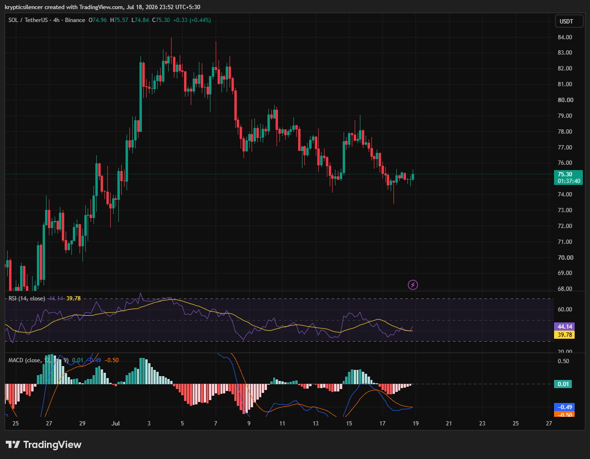

# Solana — 4H Consolidates Near Support After Sustained Downtrend

**Date:** 2026-07-18  
**Time:** ~23:52 IST  
**Instrument:** SOLUSDT  
**Timeframe:** 4H  
**Venue:** Binance  
**Charting Platform:** TradingView  

---

## Context

Following a strong rally into early July, Solana gradually transitioned into a sequence of lower highs and lower lows. Selling pressure has steadily pushed price back toward the mid-70 region, where the market is now attempting to stabilize after several days of weakness.

Price is currently consolidating near support without a decisive breakout in either direction.

---

## Observation

### 1️⃣ Downtrend Begins to Stabilize

* Price continues to respect a broader bearish structure.
* Recent candles have become smaller, reflecting reduced volatility.
* Selling pressure has eased compared to previous sessions.

The market appears to be entering a consolidation phase.

### 2️⃣ Support Holding Near Recent Lows

* Buyers have repeatedly defended the current price region.
* Recent downside attempts have struggled to produce fresh lows.
* Price remains trapped inside a relatively narrow range.

Current support remains the key level to monitor.

### 3️⃣ RSI Recovers Toward Neutral

* RSI has rebounded from weaker levels into the mid-40s.
* Momentum has improved but remains below bullish territory.
* No strong momentum breakout has developed yet.

Momentum is stabilizing but remains inconclusive.

### 4️⃣ MACD Shows Early Improvement

* MACD histogram has returned toward the zero line.
* MACD and signal line are converging after prolonged weakness.
* Bearish momentum continues to fade.

Indicators suggest downside pressure is weakening.

### 5️⃣ Range Expansion Still Pending

* Price continues to consolidate following the recent decline.
* Buyers have yet to reclaim previous swing highs.
* A decisive breakout from the current range is still required.

The next directional move will likely define the short-term trend.

---

## Hypothesis

Solana is attempting to stabilize after an extended corrective phase, but confirmation of a trend reversal remains absent.

Two conditional paths remain active:

### Scenario A — Bullish Recovery

If support continues to hold and momentum strengthens, SOL could challenge recent lower highs and begin building a recovery.

### Scenario B — Bearish Continuation

Failure to defend current support would reinforce the broader downtrend and expose lower price levels.

The current consolidation appears to be a decision point for the next directional move.

---

## Invalidation / Confirmation

* Break above recent lower highs → recovery scenario strengthens.
* RSI pushing above the 50–60 region alongside a bullish MACD crossover → bullish continuation gains credibility.
* Breakdown below current support → bearish trend resumes.

---

## Notes

Solana has shifted from a sustained decline into a period of consolidation. Momentum indicators are gradually improving, but price action has not yet confirmed a reversal. The current support zone remains the critical level for determining whether buyers can regain control or sellers resume the broader downtrend.

Text formatting and clarity were assisted by AI; the market analysis and structural interpretation are independently conducted by the author. This material is intended for educational and research documentation purposes only and does not constitute financial advice.
