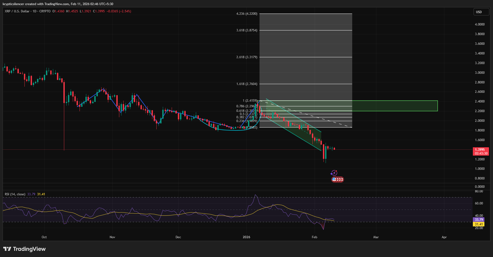

# XRP — 1D Cup & Handle Resolution After Corrective Regression

**Date:** 2026-02-11  
**Time:** ~02:45 IST  
**Instrument:** XRPUSD  
**Timeframe:** 1D  
**Venue:** Crypto / USD  
**Charting Platform:** TradingView  

---

## Context

XRP has been trading within a broader corrective structure following a prolonged decline.  
Recent price action shows the development of a **cup and handle–like formation**, suggesting potential basing rather than continued distribution.

The handle phase unfolded inside a **parallel descending regression channel**, indicating controlled corrective behavior instead of impulsive selling.

---

## Observation

- **Cup & Handle Structure:**  
  Price carved a rounded base followed by a shallow pullback (handle), consistent with a basing and compression phase after extended downside.

- **Parallel Regression:**  
  The handle formed within a descending parallel channel, reflecting orderly correction rather than trend acceleration.

- **Fibonacci Interaction:**  
  Price has **broken above key Fibonacci retracement levels** from the prior downswing, signaling improving acceptance and demand response.

- **Momentum (RSI):**  
  RSI is recovering from lower levels and stabilizing, supporting the thesis of momentum normalization rather than continuation lower.

- **Supply Zone:**  
  Overhead supply remains visible in the **~2.2–2.4** region, acting as the primary area where bullish continuation would need confirmation.

---

## Hypothesis

The combination of:
- Cup and handle formation,
- Controlled corrective regression,
- Reclaim of Fibonacci levels,

suggests conditions are aligning for a **bullish reversal attempt** rather than further bearish continuation.

Follow-through and acceptance above the handle high and nearby supply will be required to confirm continuation.  
Failure to maintain reclaimed levels would shift the structure back into range or continuation risk.

---

## Invalidation / Failure Mode

- Loss of reclaimed Fibonacci levels  
- Breakdown below the regression channel support  
- Rejection and expansion from the overhead supply zone  

---

## Notes

This analysis documents a **potential daily timeframe reversal structure emerging after a prolonged corrective phase**.

Text formatting and clarity were assisted by AI; the market analysis, chart interpretation, and structural assessment are independently conducted by the author.  
This material is intended for educational and research documentation purposes only and does not constitute financial advice.
