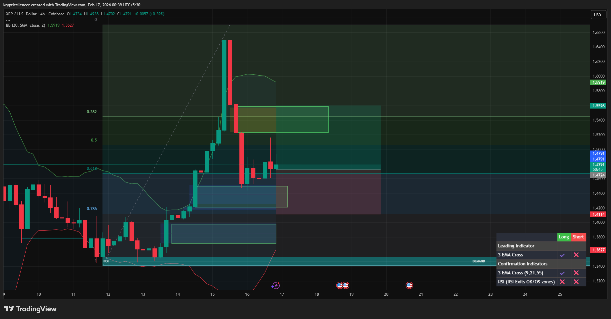

# XRP — 4H Fair Value Gap Reactions & Structured Trade Setup

**Date:** 2026-02-17  
**Time:** ~00:40 IST  
**Instrument:** XRPUSD  
**Timeframe:** 4H  
**Venue:** Coinbase  
**Charting Platform:** TradingView  

---

## Context

XRP experienced a sharp impulsive expansion, creating multiple visible Fair Value Gaps (FVGs) on the 4H timeframe.  
Following the impulse, price retraced into these inefficiency zones rather than collapsing immediately, indicating active rebalancing.

---

## Observation

- **Impulse & Imbalance:**  
  The aggressive upside leg left clear FVGs (highlighted zones), marking areas of price inefficiency.

- **FVG Revisit:**  
  Price retraced into these gaps and showed visible reaction — wicks and stabilization — suggesting participation at imbalance levels.

- **Fibonacci Confluence:**  
  Reactions aligned near deeper retracement levels (0.618–0.786 region), adding structural confluence to the imbalance zones.

- **Demand Below:**  
  A broader demand zone remains intact beneath price, acting as structural support.

- **Momentum Behavior:**  
  Momentum slowed during retracement rather than expanding aggressively downward, consistent with corrective behavior.

---

## Trade Framework

The trade idea was structured around:

- Entry near FVG reaction zone  
- Risk defined below structural support  
- Upside objective aligned with prior liquidity and retracement levels  

Execution was based on price interaction with imbalance rather than prediction of direction.

---

## Hypothesis

As long as price holds above reclaimed imbalance zones, continuation toward higher liquidity levels remains possible.

Loss of the FVG support would invalidate the setup and shift focus toward deeper retracement into broader demand.

---

## Invalidation / Failure Mode

- Acceptance below FVG reaction area  
- Breakdown below recent higher low  
- Expansion in downside momentum  

---

## Notes

This setup was derived from imbalance-based structure (Fair Value Gaps) and reaction behavior on the 4H timeframe.

Text formatting and clarity were assisted by AI; the market analysis, trade structuring, and execution rationale are independently conducted by the author.  
This material is intended for educational and research documentation purposes only and does not constitute financial advice.
