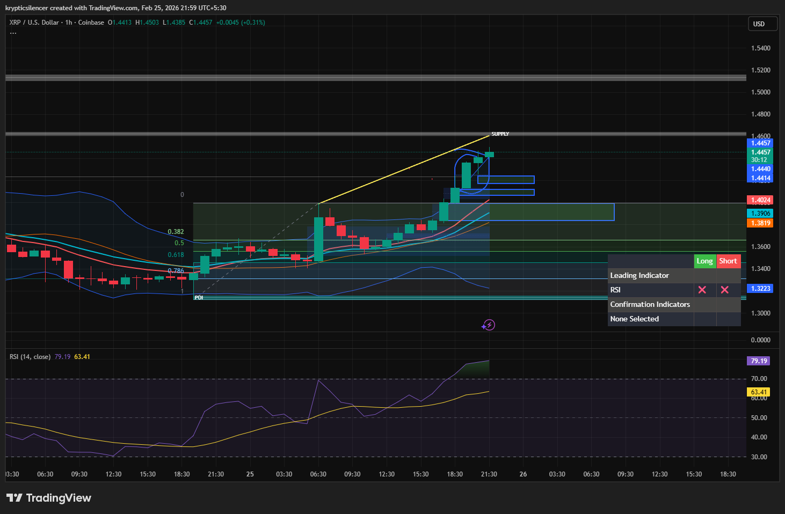

# XRP — 1H Expansion Above Bands, Mean Reversion Watch

**Date:** 2026-02-25  
**Time:** ~21:55 IST  
**Instrument:** XRPUSD  
**Timeframe:** 1H  
**Venue:** Coinbase  
**Charting Platform:** TradingView  

---

## Context

XRP has transitioned into strong upside expansion, printing consecutive higher highs and higher lows.  
Momentum accelerated into visible supply overhead with increasing volatility expansion.

Short-term structure remains bullish, but extension conditions are developing.

---

## Observation

### 1️⃣ Structural Strength
- Clear formation of higher highs.
- Higher lows maintained throughout the impulse.
- Trend alignment remains bullish on 1H.

### 2️⃣ Fair Value Gaps (FVGs)
- Multiple bullish imbalances formed during displacement.
- Inefficiencies remain unfilled below current price.
- Price currently extended away from equilibrium.

### 3️⃣ Volatility Expansion
- Candles closing above upper Bollinger Band.
- Sustained band ride indicates strong momentum.
- However, extension suggests short-term exhaustion risk.

### 4️⃣ RSI Condition
- RSI elevated near extreme levels.
- Momentum stretched relative to recent baseline.
- Divergence risk building if new highs form without RSI expansion.

---

## Hypothesis

While structure remains bullish, current positioning favors short-term mean reversion before continuation.

Two conditional paths:

### Scenario A — Mean Reversion
Pullback toward mid-band / prior FVGs to rebalance inefficiencies before potential continuation.

### Scenario B — Continuation Through Supply
Sustained acceptance above supply with RSI expansion would invalidate immediate reversion thesis.

Until rebalanced, risk-reward favors caution on late longs.

---

## Invalidation / Confirmation

- Acceptance above supply with momentum expansion → continuation.
- Loss of short-term higher low → deeper retracement likely.

---

## Notes

This setup documents upside displacement, imbalance creation, and extension beyond volatility bands — conditions that commonly precede mean reversion phases within bullish trends.

Text formatting and clarity were assisted by AI; the market analysis and structural interpretation are independently conducted by the author.  
This material is intended for educational and research documentation purposes only and does not constitute financial advice.
