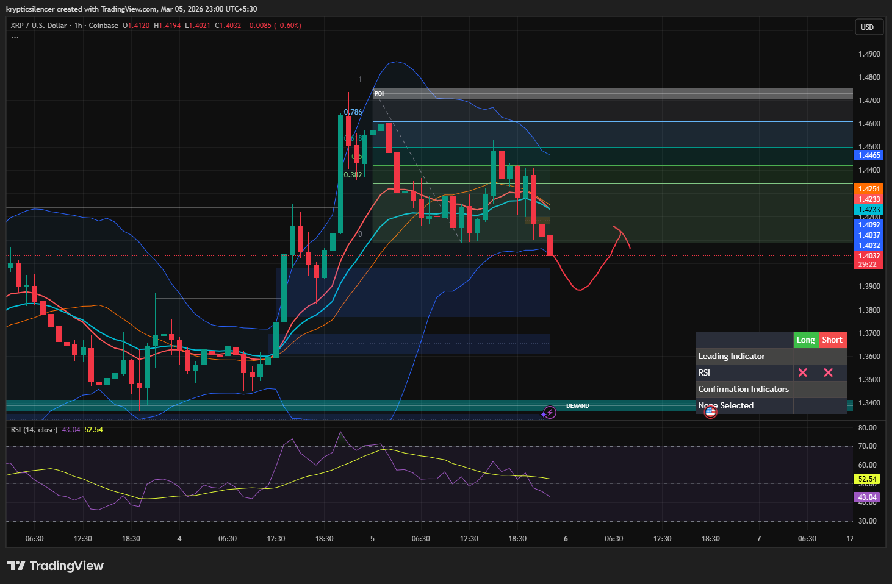

# XRP — 1H Lower Band Tag, Mean Reversion Toward Prior FVG

**Date:** 2026-03-05  
**Time:** ~23:00 IST  
**Instrument:** XRPUSD  
**Timeframe:** 1H  
**Venue:** Coinbase  
**Charting Platform:** TradingView  

---

## Context

XRP recently experienced a strong impulsive rally that left multiple inefficiencies (FVGs) within the structure.  
Following the expansion, price transitioned into a corrective phase and began rotating lower within the retracement zone.

Price has now extended toward the lower volatility boundary.

---

## Observation

### 1️⃣ Lower Bollinger Band Interaction
- Price tagged the lower Bollinger Band during the recent decline.
- Expansion to the downside suggests short-term exhaustion.
- Lower band interactions often precede mean reversion phases.

### 2️⃣ Structure Correction
- After printing a local high, price began forming lower highs.
- Current movement resembles corrective retracement rather than structural collapse.
- Market currently positioned near the lower range of the retracement zone.

### 3️⃣ Fair Value Gap Presence
- Prior bullish impulse left visible FVGs above current price.
- Inefficiencies remain unfilled.
- Market frequently revisits these imbalances before continuing directional moves.

### 4️⃣ Momentum Condition
- RSI declining toward lower mid-range levels.
- Momentum cooling following earlier bullish expansion.
- Selling pressure slowing near volatility boundary.

---

## Hypothesis

Current positioning suggests a potential short-term mean reversion before the next directional move.

Two conditional paths:

### Scenario A — Mean Reversion Toward FVG
Bounce from the lower Bollinger Band could drive price back toward the previous fair value gap region where liquidity and imbalance remain.

### Scenario B — Continued Downside
Failure to stabilize near the lower band could lead to deeper rotation toward demand below.

Until strong continuation appears, mean reversion toward imbalance remains probable.

---

## Invalidation / Confirmation

- Strong bullish reaction from lower band → move toward FVG.
- Breakdown below recent lows → continuation toward deeper demand.

---

## Notes

This setup documents volatility extension to the lower Bollinger Band with nearby inefficiencies above, suggesting potential mean reversion toward prior fair value gaps before the next structural move.

Text formatting and clarity were assisted by AI; the market analysis and structural interpretation are independently conducted by the author.  
This material is intended for educational and research documentation purposes only and does not constitute financial advice.
