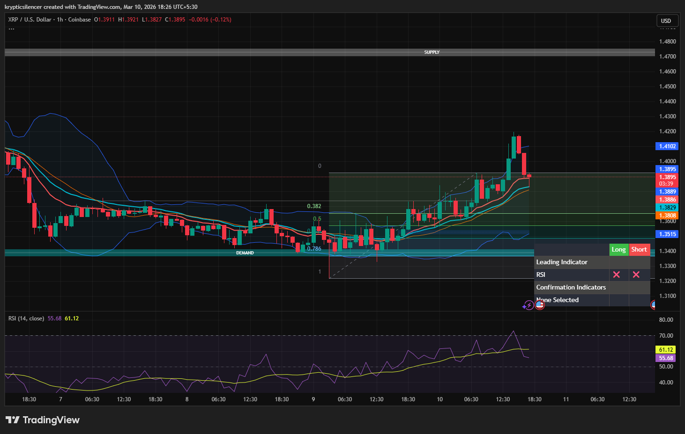

# XRP — 1H Overextension at Upper Bollinger Band, Bearish Reaction

**Date:** 2026-03-10  
**Time:** ~18:25 IST  
**Instrument:** XRPUSD  
**Timeframe:** 1H  
**Venue:** Coinbase  
**Charting Platform:** TradingView  

---

## Context

XRP recently rallied from demand, forming a steady bullish structure with higher highs and higher lows.  
The move pushed price into premium territory where volatility expanded significantly.

At the top of the move, price interacted with the upper volatility boundary.

---

## Observation

### 1️⃣ Upper Bollinger Band Extension
- Price expanded strongly into the **upper Bollinger Band**.
- Candles closed outside the band, indicating volatility extension.
- Such extensions often precede short-term mean reversion.

### 2️⃣ RSI Overbought Condition
- RSI moved **above 70**, signaling overbought momentum.
- Momentum reached exhaustion as buying pressure peaked.
- After this condition, RSI began cooling.

### 3️⃣ Bearish Reaction
- Following the volatility extension, price printed a **bearish candle**.
- Momentum shifted from expansion to early correction.
- Short-term rejection visible at the local high.

### 4️⃣ Structural Position
- Price still above prior demand and Fibonacci equilibrium levels.
- Current move appears corrective rather than structural breakdown.

---

## Hypothesis

Overextension conditions suggest a short-term pullback may follow the rally.

Two conditional paths:

### Scenario A — Mean Reversion
Price rotates toward equilibrium (mid Bollinger band / 0.382–0.5 retracement zone) before the next directional move.

### Scenario B — Momentum Continuation
If buyers quickly reclaim the highs, bullish continuation toward higher liquidity remains possible.

Until momentum rebuilds, corrective movement is likely.

---

## Invalidation / Confirmation

- Continued bearish candles below recent high → corrective move confirmed.
- Strong reclaim of highs → bullish continuation.

---

## Notes

This setup documents a volatility extension beyond the upper Bollinger Band combined with an RSI overbought condition, which often signals short-term exhaustion and potential mean reversion.

Text formatting and clarity were assisted by AI; the market analysis and structural interpretation are independently conducted by the author.  
This material is intended for educational and research documentation purposes only and does not constitute financial advice.
