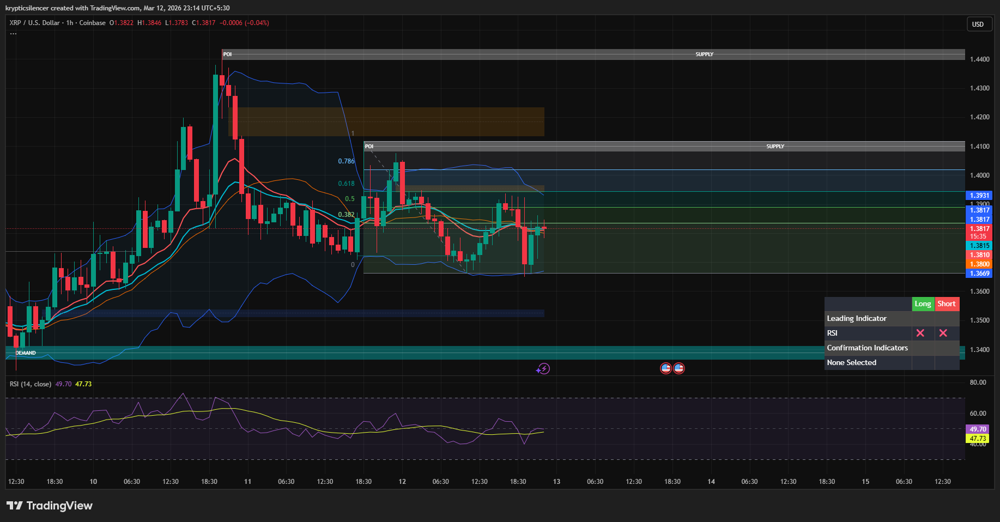

# XRP — 1H Range Consolidation Between Supply and Demand

**Date:** 2026-03-12  
**Time:** ~23:10 IST  
**Instrument:** XRPUSD  
**Timeframe:** 1H  
**Venue:** Coinbase  
**Charting Platform:** TradingView  

---

## Context

XRP previously experienced a strong upward impulse that pushed price into a higher timeframe supply zone.  
Following the rejection from this supply area, price transitioned into a corrective phase and has since been consolidating.

The market currently sits between overhead supply and lower demand.

---

## Observation

### 1️⃣ Consolidation Structure
- Price moving sideways after the initial rejection.
- Candles forming within a tight horizontal range.
- No clear trend continuation currently visible.

### 2️⃣ Supply Overhead
- A strong supply zone remains above the current price.
- Multiple attempts to push higher have stalled before reclaiming this level.
- Sellers appear active near the premium region.

### 3️⃣ Demand Support
- A defined demand zone exists below the current structure.
- Price has not revisited this level since the last bounce.
- This area remains the key support for bullish continuation.

### 4️⃣ Momentum Condition
- RSI currently near **47–49**, indicating neutral momentum.
- No strong overbought or oversold signal.
- Market appears balanced between buyers and sellers.

---

## Hypothesis

The market is currently in a **balance phase** after the earlier volatility expansion.

Two conditional paths:

### Scenario A — Bullish Expansion
If price breaks and accepts above the internal range resistance, the move could target the overhead supply zone.

### Scenario B — Rotation Toward Demand
Failure to reclaim resistance could push price back toward lower support and potentially revisit demand.

Until a breakout occurs, range behavior remains dominant.

---

## Invalidation / Confirmation

- Strong 1H close above range resistance → bullish continuation.
- Breakdown below range support → rotation toward demand.

---

## Notes

This setup reflects a typical **post-impulse consolidation**, where price stabilizes between supply and demand before the next directional move.

Text formatting and clarity were assisted by AI; the market analysis and structural interpretation are independently conducted by the author.  
This material is intended for educational and research documentation purposes only and does not constitute financial advice.
