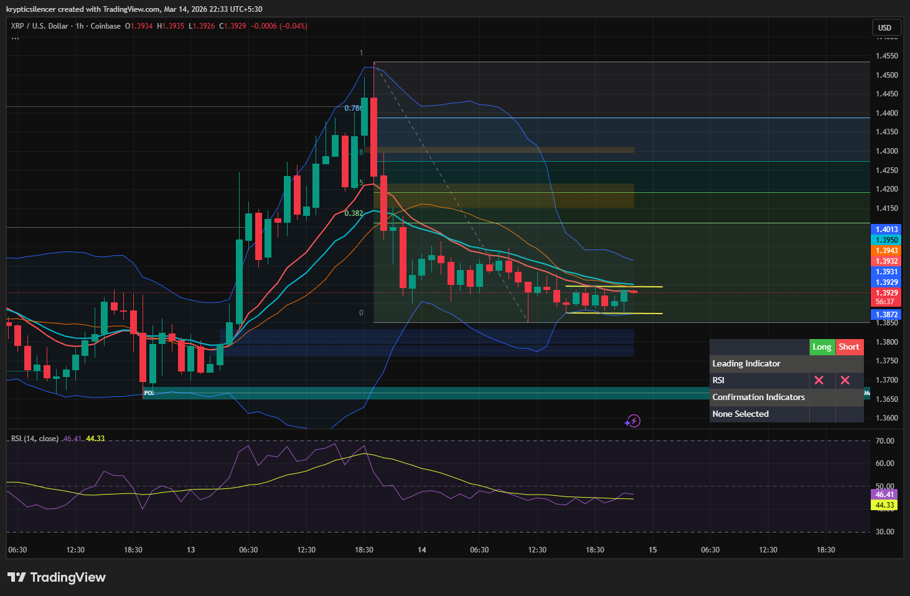

# XRP — 1H Compression Pattern, Breakout Setup Forming

**Date:** 2026-03-14  
**Time:** ~22:30 IST  
**Instrument:** XRPUSD  
**Timeframe:** 1H  
**Venue:** Coinbase  
**Charting Platform:** TradingView  

---

## Context

XRP previously experienced a strong bullish impulse followed by rejection from higher levels.  
After the rejection, price entered a corrective phase and has gradually compressed into a tight range.

The current structure suggests a **potential breakout setup** as volatility contracts.

---

## Observation

### 1️⃣ Compression Structure
- Price forming smaller candles within a narrowing range.
- Lower highs and relatively stable support forming.
- Volatility decreasing as the market approaches a decision point.

### 2️⃣ Bollinger Band Contraction
- Bollinger Bands tightening around price.
- This type of volatility compression often precedes expansion.

### 3️⃣ Momentum Condition
- RSI around **44–46**, indicating neutral momentum.
- No strong overbought or oversold condition present.
- Market currently balanced between buyers and sellers.

### 4️⃣ Key Levels
- Immediate resistance near the upper range boundary.
- Support forming around the lower consolidation level.

---

## Hypothesis

The current structure reflects **indecision before a breakout**.

Two conditional paths:

### Scenario A — Bullish Breakout
If price breaks and closes above the upper consolidation boundary, momentum may expand toward the next resistance or supply zone.

### Scenario B — Bearish Breakdown
Failure to hold support could lead to a breakdown toward deeper demand levels.

Until a breakout occurs, consolidation remains the dominant structure.

---

## Invalidation / Confirmation

- Strong 1H close above range resistance → bullish breakout confirmed.
- Breakdown below support → bearish continuation.

---

## Notes

This setup highlights **volatility compression and structural tightening**, which typically precede a directional move once the range resolves.

Text formatting and clarity were assisted by AI; the market analysis and structural interpretation are independently conducted by the author.  
This material is intended for educational and research documentation purposes only and does not constitute financial advice.
