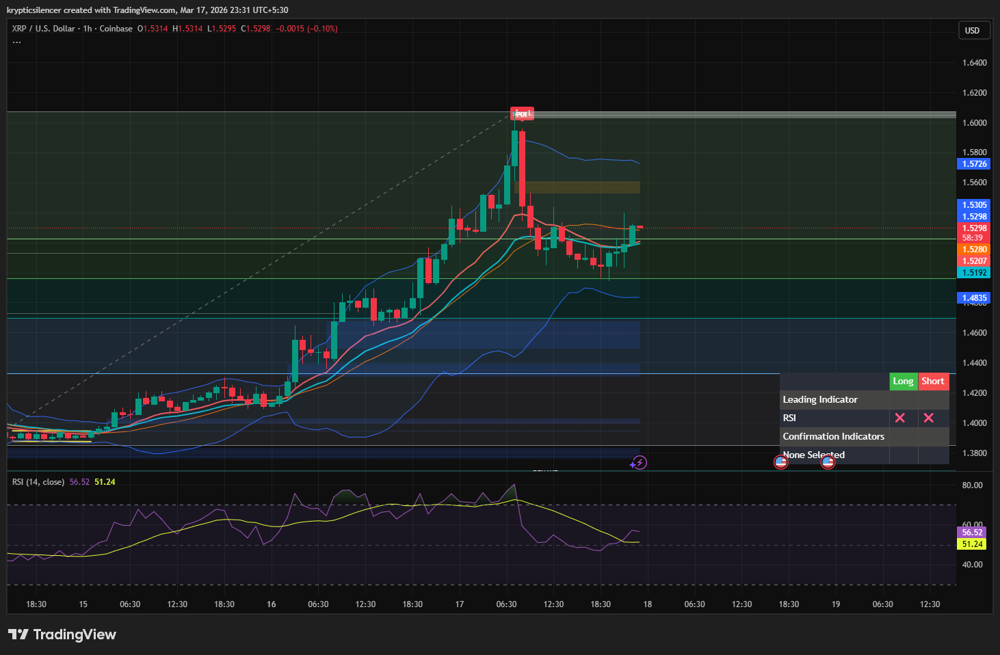

# XRP — 1H FVG Interaction & Short-Term Pullback Setup

**Date:** 2026-03-17  
**Time:** ~23:31 IST  
**Instrument:** XRPUSD  
**Timeframe:** 1H  
**Venue:** Coinbase  
**Charting Platform:** TradingView  

---

## Context

XRP is in a short-term bullish phase following a strong impulsive move upward.  
Price has recently interacted with a higher-timeframe supply zone, slowing momentum.

---

## Observation

### 1️⃣ Bullish Expansion
- Strong upward impulse with higher highs and higher lows.
- Momentum carried price into a premium zone.

### 2️⃣ Fair Value Gap (FVG)
- Inefficiency formed during the impulsive move.
- Price currently reacting near/above this imbalance region.

### 3️⃣ RSI Positioning
- RSI ~56, indicating moderate bullish strength.
- Not overbought, but momentum is cooling.

### 4️⃣ Current Behavior
- Price showing signs of consolidation/rejection near supply.
- Minor pullback structure forming.

---

## Hypothesis

### Scenario A — FVG Rebalance (Most Likely)
Price may retrace into the FVG to rebalance inefficiency before continuation.

### Scenario B — Direct Continuation
If momentum sustains, XRP may hold above the FVG and continue upward without deeper pullback.

---

## Invalidation / Confirmation

- Breakdown below FVG → deeper correction likely.
- Strong reclaim and continuation above current range → bullish continuation.

---

## Notes

This setup highlights post-impulse behavior where price seeks efficiency before continuation.

Text formatting and clarity were assisted by AI; the market analysis and structural interpretation are independently conducted by the author.  
This material is intended for educational and research documentation purposes only and does not constitute financial advice.
